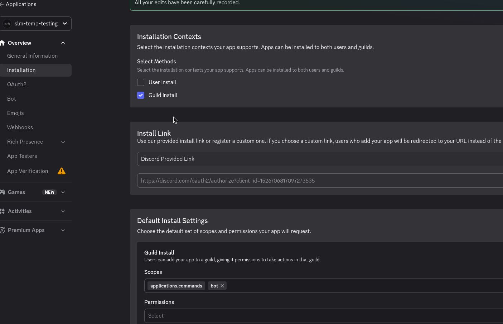
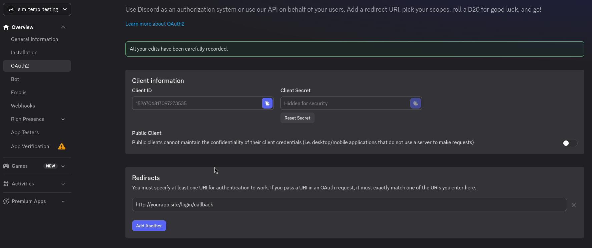
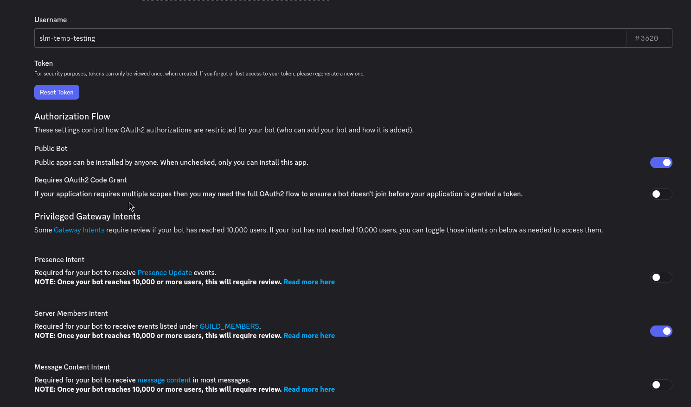

# Installing SLM

### 1. Prerequisites

1. Docker, and a server to run it on: [installation instructions](https://docs.docker.com/get-docker/)
2. A domain and some way to send traffic to SLM.
3. A Discord server, which you have permissions to install apps on.

### 2. Where to Install

SLM needs access to your Squad Server's log files in order to function. This can be done either locally by mounting the log files directly into the container, via an SFTP connection(this works with PSG-hosted servers for example), or by running a server agent on the game host that streams log data (and proxies RCON) to the SLM server (see [CONFIGURING.md#server-agent](CONFIGURING.md#server-agent) for more). SLM can be set up with any number of squad servers, so keep that in mind as well when deciding where to install it.

### 3. Installation

#### 3.1. Docker Compose

```sh
mkdir squad-layer-manager && cd squad-layer-manager
curl -fsSL https://raw.githubusercontent.com/Tactrigsds/squad-layer-manager/main/install.sh | bash
```

This lays down the files a deployment is made of: `docker-compose.yaml`, a `.env` (copied from `.env.example`, which is left alongside it), a `.env.secrets` (copied from `.env.secrets.example`, and holding every credential SLM reads: see [3.3](#33-secrets)), the `edit-global-settings.sh` and `restore.sh` helpers, and an `observability/` directory of Grafana, Loki, and Tempo config. It also creates a `data/` directory, which houses the database file and any persistent data and will be bind-mounted to the app container.

#### 3.2. Discord app

SLM authenticates users through a discord app you own, installed on your org's discord server.

Create one at [discord.com/developers/applications](https://discord.com/developers/applications).

Then, make the settings match these screenshots:


Note the `applications.commands` and `bot` scopes. Both are needed.

Register `<ORIGIN>/login/callback` as a redirect uri, where ORIGIN is wherever you're planning on serving SLM from.


Set ORIGIN in `.env` to match (without `/login/callback`), and fill out `DISCORD_CLIENT_ID` in `.env`. `DISCORD_CLIENT_SECRET` is a credential, so it goes in `.env.secrets` instead (see [3.3](#33-secrets)).

Configure the bot's intents as such:


Copy your bot token into `DISCORD_BOT_TOKEN` in the `.env.secrets` file.

If you don't have access to install the app on your org's discord server, then you may have to set it to public so that someone with access can install it. You can uncheck this option once it's installed.

Set `DISCORD_HOME_GUILD_ID` to the id of your org's discord server. To find this, enable Developer Mode in your discord settings, and right-click on the server icon. Only members of the server can be granted access to SLM.

Set at least one `SUPER_USERS` id to your discord user id (available by clicking your profile picture with developer mode enabled), or nobody can administer the app: they are granted every permission
unconditionally, and are the bootstrap you cannot lock yourself out of. This person must be a member of your org's discord server.

Next, install the app on your org's discord server by visiting the install link on the `Installation` page. Make sure it's the same one as `DISCORD_HOME_GUILD_ID` in the `.env` file.

#### 3.3. Secrets

Every credential SLM reads lives in `.env.secrets`, apart from the rest of the configuration in `.env`:

| variable                             | what it is                                                          |
| ------------------------------------ | ------------------------------------------------------------------- |
| `SETTINGS_ENCRYPTION_KEY`            | encrypts sensitive settings at rest (see [3.4](#34-encryption-key)) |
| `DISCORD_CLIENT_SECRET`              | the discord app's oauth2 client secret                              |
| `DISCORD_BOT_TOKEN`                  | the discord bot token                                               |
| `BM_PAT`                             | the battlemetrics personal access token                             |
| `BACKUP_SFTP_PASSWORD`               | if backups upload to an sftp host                                   |
| `BACKUP_SFTP_PRIVATE_KEY_PASSPHRASE` | if that host authenticates with an encrypted key                    |

`install.sh` writes this file for you from `.env.secrets.example`, `chmod 600`, with a freshly generated
`SETTINGS_ENCRYPTION_KEY` already in it. Fill in the rest as you work through the sections below. Keep it out of
version control, and out of any backup you would not also put a password in.

**Mount this file into the container. Do not pass these as environment variables.** The `docker-compose.yaml`
you installed already does:

```yaml
services:
  app:
    volumes:
      - ./.env.secrets:/app/.env.secrets:ro
    env_file: .env
```

A container's environment is not a private place. Anyone who can reach the docker daemon reads all of it back
with `docker inspect`, it sits in `/proc/<pid>/environ` for anyone on the host who can see the process, and
every library and subprocess inside the container can read it out of the environment they inherit. None of that
is a bug in docker: it is what an environment is, which is why it is the wrong place to put a password. SLM
reads `.env.secrets` as a file and never loads what is in it into its own environment, so your credentials
reach none of those places. Everything else goes on being handed over as `env_file: .env`, where being readable
costs nothing, since it describes the shape of the install rather than the keys to it.

SLM still reads any of these from a real environment variable if it finds one there, so an install predating
this split keeps working. It warns on boot when it does, naming the variables: nothing stops you passing them
that way, it just costs you what the file is for.

If your secrets come from a secrets manager, mount whatever file it produces and point `SECRETS_FILE` at it. As
a docker secret, for instance:

```yaml
services:
  app:
    environment:
      - SECRETS_FILE=/run/secrets/slm-secrets
    secrets:
      - slm-secrets

secrets:
  slm-secrets:
    file: ./.env.secrets
```

The format is the same wherever it is mounted: `KEY=value`, one per line. A `SECRETS_FILE` pointing at
something that isn't there stops the boot, rather than quietly coming up without your credentials.

#### 3.4. Encryption key

SLM encrypts sensitive settings at rest (each server's RCON and SFTP passwords and its server-agent token). This is keyed by `SETTINGS_ENCRYPTION_KEY`, which is required: the app refuses to start without it. `install.sh` generates one into `.env.secrets` for you; if it wasn't able to, or you installed by hand, generate a strong key and paste it in there yourself:

```sh
openssl rand -base64 32
```

Keep this key safe and stable. If you change or lose it, the already-encrypted connection secrets can no longer be decrypted and have to be re-entered on the settings page. The first boot after setting the key transparently encrypts any connection secrets that were previously stored in plaintext.

#### 3.5. Battlemetrics

SLM has a battlemetrics integration. Among other things, it lets users update players flags remotely, and gives more context when managing players on the servers.

Set `BM_PAT` (in `.env.secrets`, it is a credential) to a battlemetrics personal access token, and `BM_ORG_ID` (in `.env`) to your org's battlemetrics id.
Check the environment variable's description of BM_PAT for the required scopes.

#### 3.6. Backups

Backups happen for two reasons. One of them is not optional.

**Before every migration**, always, the database is snapshotted into `BACKUPS_DIR` first. This happens whether
the app applies migrations itself at boot (`DB_AUTOMIGRATE`, the default) or you run `pnpm db:migrate:prod`
yourself, and it is what you restore from if an upgrade turns out to have been a mistake. Nothing is applied if
the snapshot fails. These are named `slm-backup-db-pre-migration-20260713-134504.sqlite3.gz`, and the most
recent one is never deleted by retention, however old it gets: it is the only way back from the migration it
was taken before.

A migration will not run against a database another process has open: SQLite offers no safe way to change a
schema under a running app, so the app refuses to boot, or `db:migrate` exits non-zero, rather than risk it.
An idle app still counts as using the database. Stop it first.

**Periodically** is off by default. Set `AUTOMATIC_BACKUPS_PERIODIC` to a duration (e.g. `72h`) and the app will
snapshot its database on that interval, optionally shipping each one to an SFTP host.

The two share a schedule and a retention window rather than running as separate systems. A backup taken to
migrate counts as that interval's backup (it is uploaded and recorded like any other), so an upgrade doesn't
produce two copies of the same database a minute apart, and the next periodic one is a full interval later.

A snapshot is taken with sqlite's online backup API, so it is a consistent point-in-time copy taken without
locking the app out of its own database, and it is gzipped (typically 5-10x smaller) before being stored or
uploaded. Backups are named after the database they came from, e.g. `slm-backup-db-20260713-134504.sqlite3.gz`.
Each run is recorded in the audit log as a `BACKUP_CREATED` event.

The schedule is anchored to the last backup that actually happened, not to boot, so a server restarted more
often than the interval still gets backed up. A backup that came due while the app was down is taken shortly
after it comes back up.

| variable                             | default          | what it does                                                          |
| ------------------------------------ | ---------------- | --------------------------------------------------------------------- |
| `AUTOMATIC_BACKUPS_PERIODIC`         | unset (disabled) | how often to back up, e.g. `72h`                                      |
| `EVENT_HISTORY_RETENTION_PERIOD`     | unset (disabled) | prune server events older than this, e.g. `90d` (see below)           |
| `BACKUPS_DIR`                        | `./data/backups` | where backups are written                                             |
| `BACKUPS_RETAIN_COUNT`               | `10`             | how many backups to keep, locally and remotely. `0` keeps all of them |
| `BACKUP_SFTP_HOST`                   | unset (disabled) | setting this uploads each backup to that host                         |
| `BACKUP_SFTP_PORT`                   | `22`             |                                                                       |
| `BACKUP_SFTP_USERNAME`               |                  | required when a host is set                                           |
| `BACKUP_SFTP_PASSWORD`               |                  | this or a private key is required when a host is set                  |
| `BACKUP_SFTP_PRIVATE_KEY_PATH`       |                  | path to a private key, as an alternative to a password                |
| `BACKUP_SFTP_PRIVATE_KEY_PASSPHRASE` |                  | if the key needs one                                                  |
| `BACKUP_SFTP_DIR`                    | `.`              | remote directory, created if missing                                  |

`BACKUPS_RETAIN_COUNT` is one window over both kinds: the newest N backups survive, whatever they were taken
for, plus the most recent pre-migration one, so you may hold N+1. Two SLM instances must not share a
`BACKUP_SFTP_DIR` unless their databases are named differently: retention deletes any backup matching its own
name, so they would prune each other's.

A failed upload does not fail the backup. The local copy is still written, and the audit event records that it
never left the box.

##### Restoring

`restore.sh` stops the app, puts a backup back, and starts it again:

```sh
./restore.sh --list             # what backups there are
./restore.sh --pre-migration    # the snapshot taken before the last migration: undo a bad upgrade
./restore.sh --latest           # the newest backup of any kind
./restore.sh --from slm-backup-db-20260713-134504.sqlite3.gz    # a specific one
```

`--from` also takes a path, which is how you restore a backup fetched back off the SFTP target. Drop it in
`data/backups` or pass the full path.

The database being replaced is kept, renamed to `db.sqlite3.replaced-<timestamp>` next to it, because a restore
is otherwise the one operation with no undo. Delete it once you are happy. The restore is checked
(`integrity_check`) before anything is moved, so a corrupt archive costs nothing.

Prefer this over doing it by hand. `gunzip -c backup.gz > data/db.sqlite3` looks complete and is not: the old
`-wal` file is still sitting there, SQLite replays it over the file you just restored, and you silently get the
**old** database back, with `integrity_check` calling it fine. Restoring while the app is running is worse, as
the app goes on writing to a database that is no longer at that path, and those writes are simply lost.

If you are rolling back a bad upgrade, roll the image back too. Restoring a pre-migration backup and then
starting the same version just applies the same migration again (the restore says so if the database it put
back is behind the build).

#### 3.7. Event history retention

`EVENT_HISTORY_RETENTION_PERIOD` prunes old server events (chat, kills, connects) as part of each backup run,
which is what keeps the database from growing without bound. Events are deleted for matches older than the
retention period, except that the 100 most recent matches per server are always kept regardless of age (the app loads them at startup). Match records themselves are never deleted, only their events, and neither is the audit log. The prune runs before the snapshot, so a backup never carries rows that were just dropped.

The first prune after turning this on clears the whole accumulated backlog and is much larger than the ones
that follow.

#### 3.8. Telemetry

Detailed logs and telemetry are available via grafana, hosted at `http://localhost:3001`, which you may also want to expose to the internet. Just make sure to change the default admin password before doing so. see [https://grafana.com/docs/grafana/latest/introduction/](https://grafana.com/docs/grafana/latest/introduction/) for more. There is a dashboard set up there preconfigured to assist with monitoring SLM.

If you don't want any telemetry, then set `OTEL_ENABLED=false`, and comment out or delete the otel service from `docker-compose.yaml` before starting the app.

#### 3.9. Starting SLM

Assuming that your system already has docker installed and running, and you've got a public url for the server, you can start it up.

`docker compose up -d`

If docker is configured to start on boot, then the app will start automatically when the system boots in the event of a reboot.

Stop everything with `docker compose down`. If you want to stop just the app while leaving grafana running, use `docker compose stop app`.

Once you've got the app running, you'll be able to sign in with discord OAuth, and you can move on to [configuring SLM](CONFIGURING.md).

#### 3.10. Upgrading

```sh
docker compose pull && docker compose up -d
```

Migrations are applied on boot by default; set `DB_AUTOMIGRATE=0` to disable this behavior. Either way the
database is backed up first (see [3.6](#36-backups)), so a bad upgrade is recoverable.

An install that predates `.env.secrets` keeps working untouched: SLM reads the credentials from wherever it
finds them. To move them out of the environment (see [3.3](#33-secrets)), take the six variables in that
section out of your `.env` and put them in a `.env.secrets` next to it, then add the mount to the `app` service
in your `docker-compose.yaml` before `docker compose up -d`:

```yaml
volumes:
  - ./.env.secrets:/app/.env.secrets:ro
```

Run migrations manually with `docker compose run --rm app pnpm db:migrate:prod`.
