# Configuring SLM

This guide assumes you have a running instance of SLM. See [installing.md](installing.md) if you do not.

You configure SLM mostly from the settings page. Most settings can keep their defaults, but a few must be set before
SLM can run your server.

Open the settings page from the header:

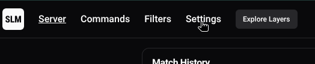

Use the table of contents on the left to move between sections:

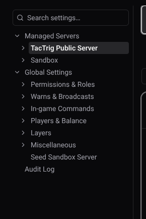

Each setting has a _GUI_ / _JSON_ toggle, so you can also edit it as JSON. Settings that most installs never
change sit in a collapsed _Advanced_ disclosure at the bottom of their section. The table of contents still lists
them, and navigating to one opens the disclosure it sits in.

### 1. Admin lists

The admin list settings are under _Permissions & Roles_.

An _admin list_ is the standard `Admins.cfg` format, which SLM reads as-is. Point it at a file mounted into the
container, or at a copy hosted over SFTP or HTTP(S).

By default, SLM treats a player with the `canseeadminchat` role as an admin. If your list uses a different role,
change this setting:

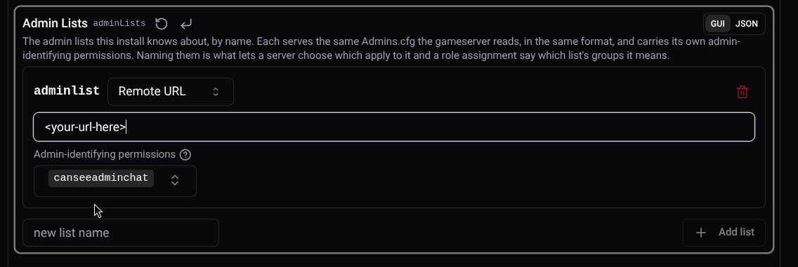

An admin list identifies a player by steam ID or EOS ID, and one list can use a mix of the two.

You can configure more than one admin list, which is useful when each of your servers has its own. Each server names
the lists that apply to it. See [2.2](#22-server-admin-lists).

The groups in your admin list do more than mark who is an admin. You can also:

- assign [SLM roles](#34-assigning-roles) to the members of a group
- [colour players by group](#6-player-groupings) in the players panel and the activity charts

When you add your first real admin list, add it to the `admins` role as well. The default assignment names only the
sandbox's own list, so a new list grants nobody the `admins` role until you name it there. See
[3.4](#34-assigning-roles).

### 2. Adding your server

One SLM instance can manage several squad servers.

A fresh install already has a server named _Sandbox_. It attaches to an emulated squad server, which imitates a real
one closely enough for SLM to work against. Use it to test things out. See
[sandbox_servers.md](sandbox_servers.md).

Click _Add Server_ to set up a real one:

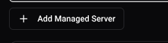

#### 2.1. Connecting the server

Each server uses one of three connection modes:

- _local_ - SLM shares the machine with the squad server, reading `SquadGame.log` from disk and dialling RCON
  directly. Lowest latency for SLM's event processing. Needs a log file path and RCON details.
- _sftp_ - SLM runs elsewhere, tailing the log file over SFTP and dialling RCON over the network. Use this with
  PSG-hosted squad servers, where you cannot run a program on the game host. Needs SFTP and RCON details.
- _server agent_ (recommended) - a small program on the game host handles both the log stream and RCON. SLM never
  holds the RCON password, and never has to reach the RCON port. Needs only a shared token. See
  [server_agent.md](server_agent.md).

If a server does not behave as you expect, open the [server console](server_console.md). It shows the RCON traffic
and the log lines as SLM receives them, which tells you whether the connection or SLM is at fault.

#### 2.2. Server admin lists

Name which of your [configured admin lists](#1-admin-lists) apply to this server:

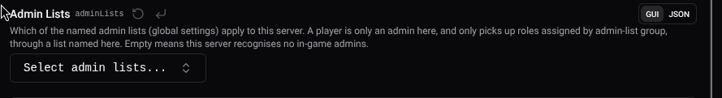

A player counts as an admin on this server, and picks up roles from an admin list group, only through a list named
here. If you name none, SLM recognises no in-game admins on this server.

### 3. Permissions

SLM has a role-based access control (RBAC) system. A _role_ holds a set of _permissions_, which it grants to
everyone assigned that role. Some permissions are global; many can be scoped to one squad server.

Unlike discord roles, SLM roles are not hierarchical: no role outranks another. Someone holds the sum of every role
they are assigned, except that a denial in any one role beats an allow in another.

#### 3.1. Super users

A fresh install has no role assignments of its own, so the `SUPER_USERS` and `SUPER_ROLES` you set in `.env` are the
bootstrap. They hold every permission unconditionally, including unlimited kick timeouts, and you cannot change them
from the settings page:

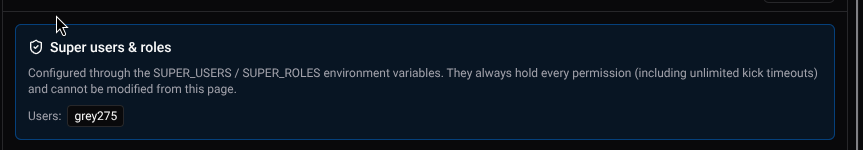

Keep at least one after you assign real roles, so you can still get in if an assignment goes wrong.

#### 3.2. Default roles

Go to the _Permissions & Roles_ section of the global settings. Three roles exist by default:

- `admins` - the features needed for day-to-day operations: the queue, votes, filters, and managing, warning,
  broadcasting to and kicking players. Maximum timeout of 2h. It is assigned to the in-game admins of the sandbox's
  own admin list, so the in-game commands work before anyone configures RBAC. Point it at your real lists as you
  add them.
- `managers` - everything `admins` can do, plus policing other people's queue notes, enabling and disabling servers,
  and restarting SLM. It can edit every global setting except the permissions config, and every server setting
  except the connection details. Maximum timeout of 6h. It cannot add a server, because adding one means supplying
  connection details.
- `owners` - every permission. Maximum timeout of 52w. It is assigned to nobody by default.

All three cover a new server on their own: their permissions are granted unscoped, and the `managers` settings
grant names no servers, which means every server. Only a role that narrows a permission or a settings grant to
named servers needs revisiting when you add one.

#### 3.3. Assigning permissions to roles

The _Permissions_ table holds everything a role may do. Each row is one permission, with three columns:

| Column       | What it holds                                                                                     |
| ------------ | ------------------------------------------------------------------------------------------------- |
| _Effect_     | Allow or Deny. A denial overrides an allow, so use it to carve an exception out of a wider grant. |
| _Permission_ | The permission itself, or `*` for all of them.                                                    |
| _Scope_      | What narrows the permission. Leave it empty to grant the permission unrestricted.                 |

A scope names specific servers, specific setting paths, or a cap such as a maximum timeout.

Settings access works the same way:

- `global-settings:write` takes dotted setting paths, such as `vote.voteDuration`, or `vote` for the whole section.
  Leave the scope empty and the role can edit every global setting. Either way it implies `global-settings:read`.
- `server-settings:write` is the same for a server's settings, and its scope can also name specific servers. It
  never reaches the connection details.
- `server-settings:write-sensitive` is a separate permission. It is the only way to view or edit a server's RCON and
  SFTP connection details.

#### 3.4. Assigning roles

You can assign a role to a user or to a player:

- a _user_ signs in with their discord account and works from the web interface
- a _player_ is in the game and uses the [in-game commands](#5-in-game-commands)

A user can link their discord account to their in-game account, and the permissions from both then combine for
every action. This is optional, and matters mostly for people who hold elevated permissions on their user account
and want to use them in game.

The _Assignments_ subsection of a role holds five sources. Two of them cover in-game players:

- _In-game admins of these lists_ - the role goes to every player an admin list counts as an admin. It applies
  only on servers that use that list.
- _Admin-list groups_ - the role goes to the members of a named group in a named list, whether or not that group
  identifies admins. A whitelist reserve-slot group works here. Again, it applies only on servers that use the list.

The other three cover users, and take an individual discord user, a discord role, or every member of your discord
server:

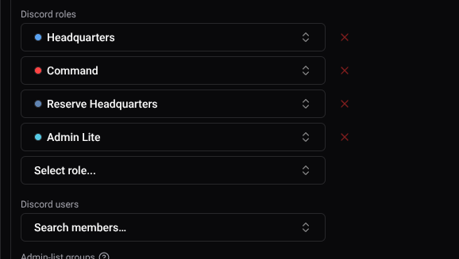

#### 3.5. Testing assigned permissions

Every user can see the permissions they hold, in the permissions info dialog:

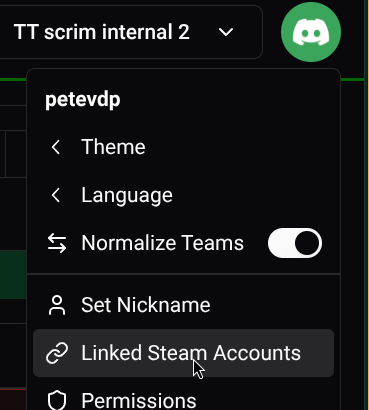
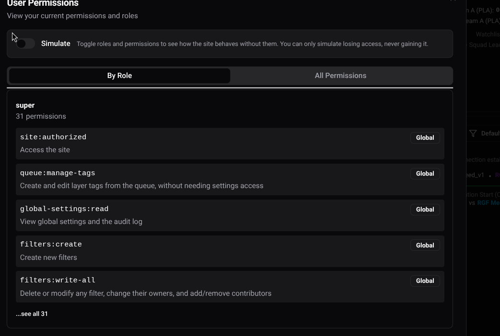

The dialog groups permissions by role or by permission, and traces each one back to the role that granted it.

Click _Simulate Permissions_ to check and uncheck roles, and see how the interface behaves for someone who holds
them:

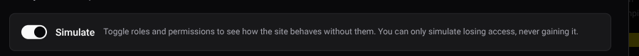
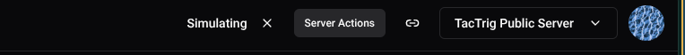

The simulation runs in your browser only. The server still checks your real permissions, so any action the interface
does not gate runs with what you actually hold.

### 4. Warns, broadcasts and admin actions

The _Warns & Broadcasts_ section holds the messages SLM shows to players: admin warnings, kicks, broadcasts, and
more.

Configure reasons such as teamkilling, spamming or soloing under _Admin Action Reasons_. Each reason carries one
text per action, where an action is a warn, a broadcast, a kick, a timeout, and so on:

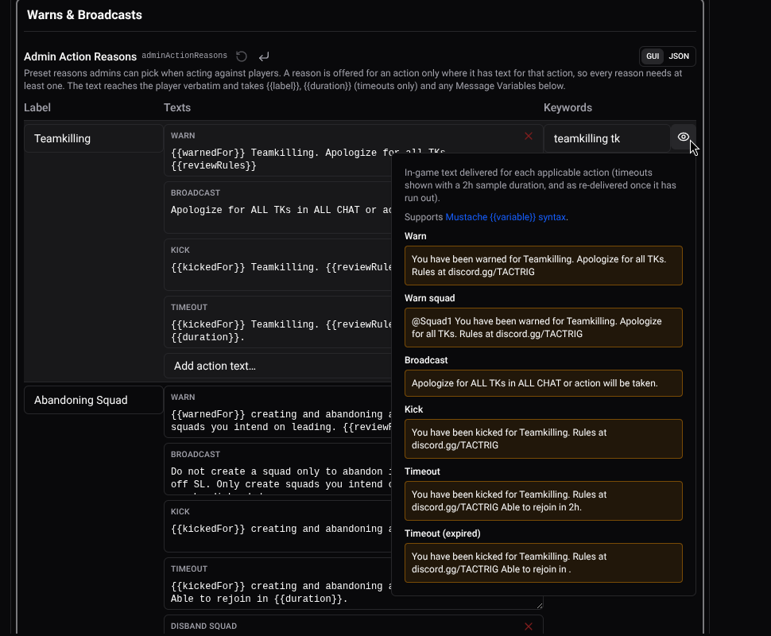

Write the texts as [mustache](https://mustache.github.io/mustache.5.html) templates. _Message Variables_ in the
same section holds reusable snippets. You can use one in several texts, or inside another message variable.

_Require a Reason_ makes a reason mandatory for the actions you name:

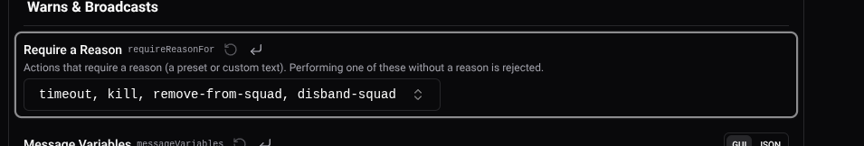

The user can still type a freeform reason instead of choosing a configured one.

Admins then use a configured reason with the in-game `/warn`, `/broadcast`, `/kick`, `/timeout` and other commands,
as long as that reason has text for the action: a reason with no kick text cannot be used to kick.

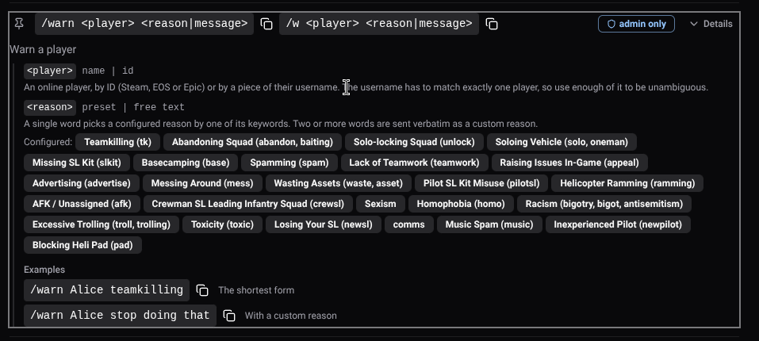

Reasons are also selectable when you perform an action from the interface:

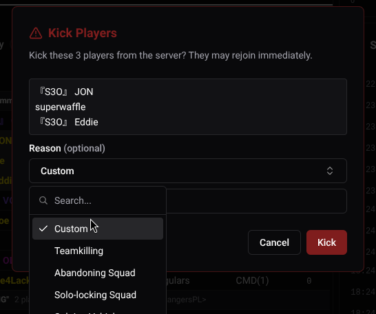
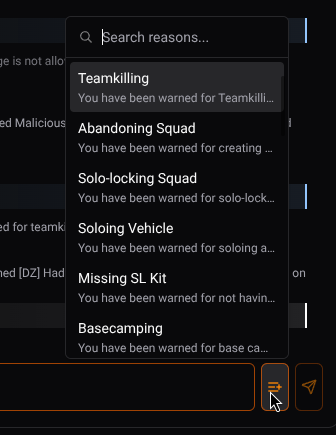

### 5. In-game commands

SLM has a large set of in-game commands. The commands page in your own install documents each command and how to use
it:

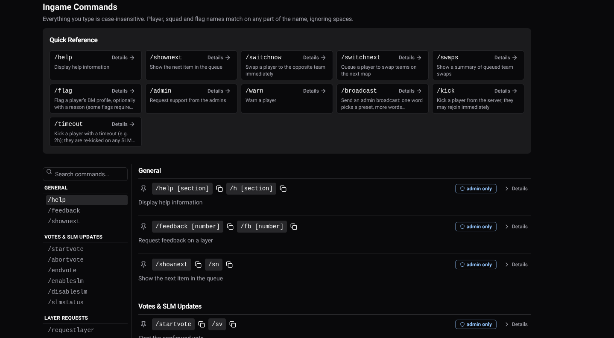

#### 5.1. Command prefixes

By default, every command has the prefix `/`. Change this prefix, or add another, in _Allowed Prefixes_, under
_Advanced_ in the _In-game Commands_ section:

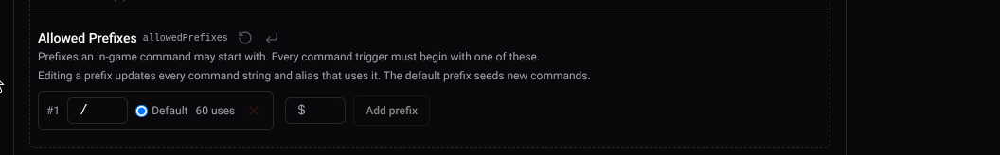

If you change an existing prefix, SLM moves every [trigger](#52-command-triggers) with that prefix to the new one.

> [!TIP]
> Pick a prefix that does not collide with the commands you already run. Some SLM commands behave differently from
> their squadjs counterparts, which confuses users. Disable the old command instead, with a message that points
> users at the SLM one.

#### 5.2. Command triggers

An in-game command runs from one of its _triggers_: the strings listed against it under
_Settings > In-game Commands_. `/timeout` and `/to` are two triggers for the same command, and typing either takes
the command's arguments exactly as written.

A trigger can also pin some of those arguments, which turns it into a shortcut. Give `/to2h` the `args` template
`{{arg1}} 2h {{rest2}}`, and typing `/to2h Alice spamming` runs `/timeout Alice 2h spamming`. This is what command
aliases used to be.

See [command_triggers.md](command_triggers.md) for the template syntax, what happens to words the caller leaves out,
and the limits on what a trigger can reach.

### 6. Player groupings

A _player grouping_ sorts players into named, coloured groups, for administration and for monitoring balance.
Configure them under _Players & Balance_.

A grouping is an ordered list of rules, and a player joins the group of the first rule they match.

A rule can match on:

- a battlemetrics player flag
- an [admin list group](#1-admin-lists)
- a regex on the player's username, which includes any tags they have configured
- a discord role, if the player's steam account is linked to their discord account

Here is a grouping keyed on admin list groups:

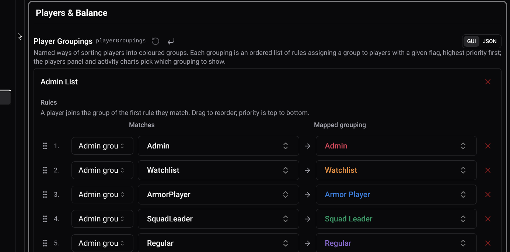

And here is TacTrig's grouping for monitoring balance:

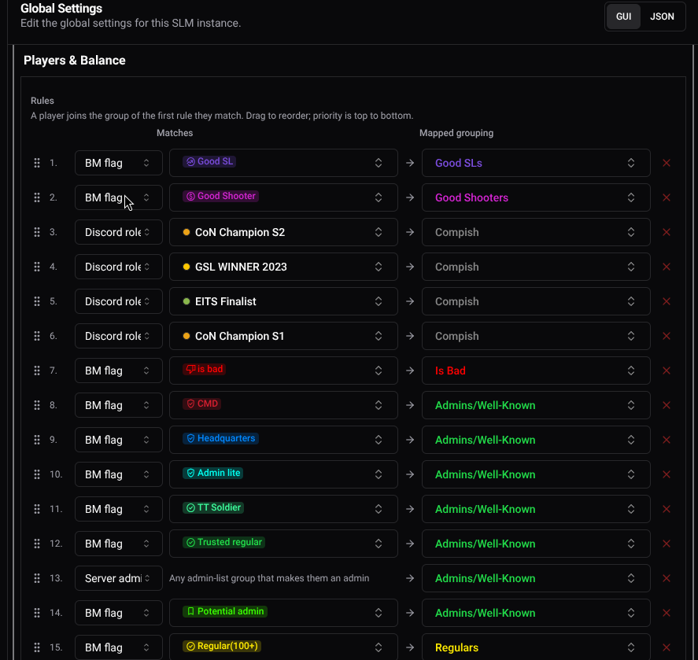

> [!NOTE]
> Maintaining discord to steam account links is a manual process today. A REST api that lets external tools manage
> the links is planned.

SLM then colour-codes the usernames of grouped players wherever they appear:

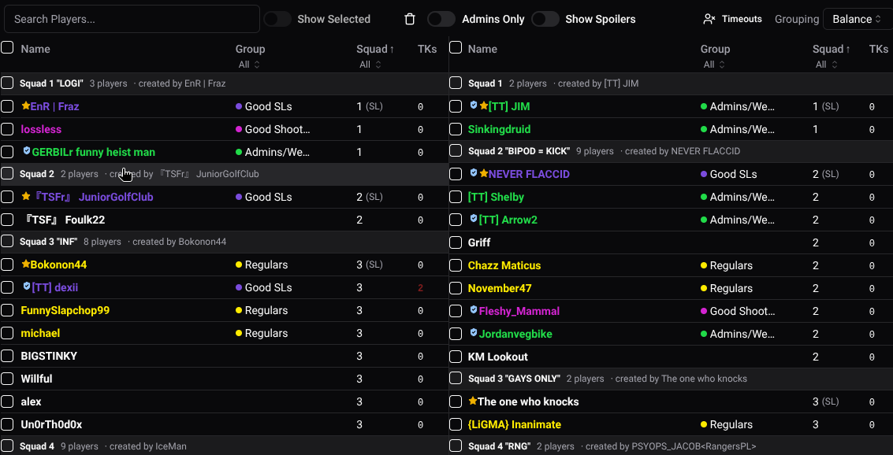

The players panel and the activity charts pick which grouping to show, and the stats panel breaks the population
down by it:

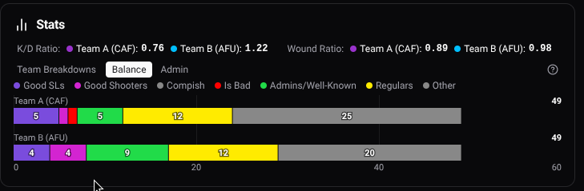

### 7. Player flagging

You can apply a battlemetrics flag to a player from in game with the `/flag` command, or from the SLM interface:

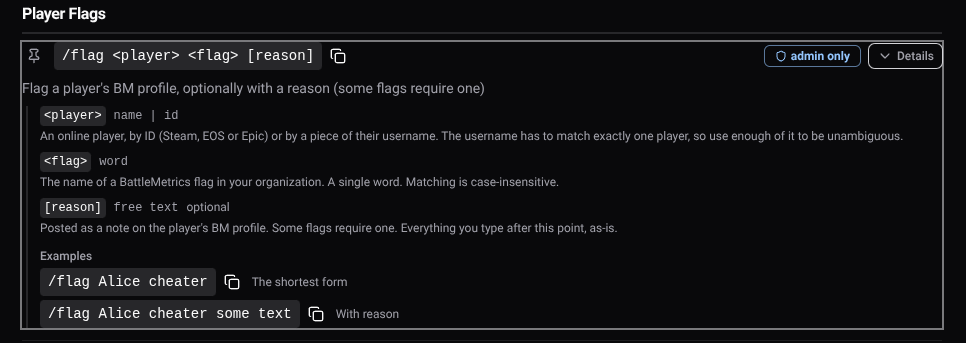
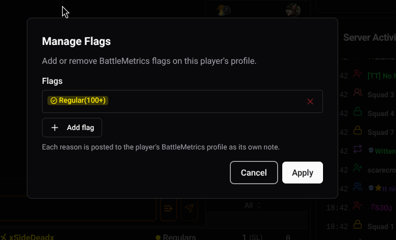

A user can add a reason for the flag, which SLM posts as a note on the player's battlemetrics profile. The note is
freeform text for now, and is not connected to the [admin action reasons](#4-warns-broadcasts-and-admin-actions).
This may change.

To require a note for a particular flag, name it in _Player Flags Requiring Note_:

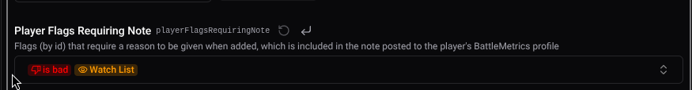
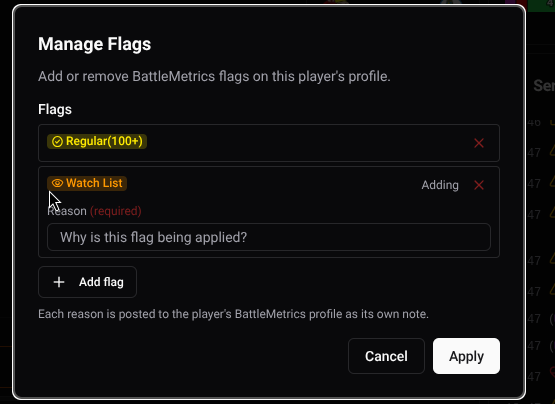

A flag set from the battlemetrics interface can take a while to appear in SLM, which caches battlemetrics data
aggressively to stay inside their rate limits. To see a change immediately, purge the cache for that player with the
_refresh_ button:

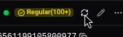

SLM refreshes a player's flags automatically when it changes them itself.

### 8. Layer pools and filters

#### 8.1. Filters

Squad has about 730,000 possible layers, counting every map, gamemode, faction and unit combination. A _filter_ is
a named expression that picks a subset of them out. SLM ships with a few, listed in the filters index:

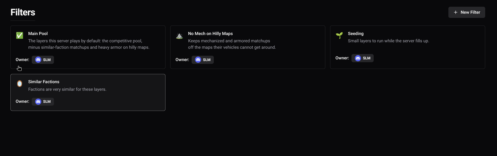

Open one and you get the expression that decides what it matches:

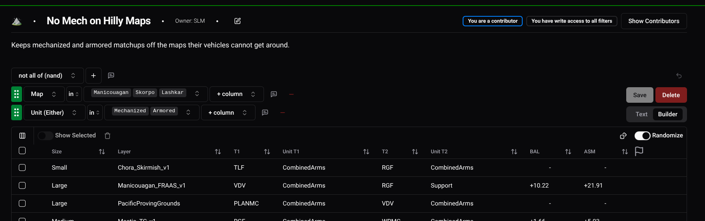

The block at the top sets how the conditions under it combine. The four block types are _all of (and)_,
_any of (or)_, _none of (nor)_ and _not all of (nand)_. _No Mech on Hilly Maps_ uses _not all of (nand)_,
so a layer matches unless both of these hold:

- `Map` is Manicouagan, Skorpo or Lashkar
- `Unit (Either)` is Mechanized or Armored

A filter does nothing on its own: other settings point at it, and one filter can be used inside another.
_Main Pool_ is built out of two of the others:

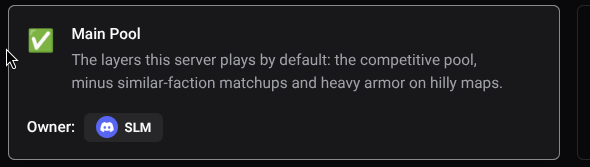
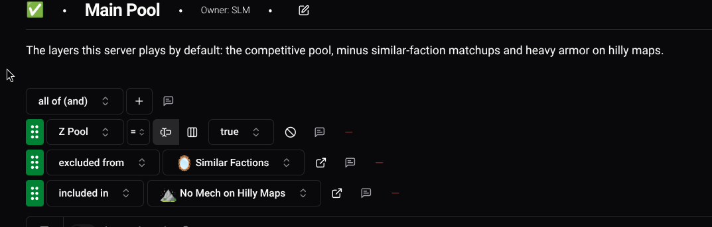

It uses _all of (and)_, so a layer has to meet every one of:

- `Z_Pool` is true, shown as `Z Pool` in the builder. This is one of the extra columns that ship with SLM's layer
  data, and it marks the competitive pool. See [layer_data.md](layer_data.md).
- the layer is excluded from _Similar Factions_
- the layer is included in _No Mech on Hilly Maps_

Switch a filter between _Builder_ and _Text_. The text view edits the expression as text, which is easier for
changes the builder makes you do a row at a time, such as copying part of an expression or changing how its
conditions nest. _Reformat_ tidies the text up.

#### 8.2. Pool configuration

_Pool Configuration_ decides which layers count as playable, which ones raise warnings, and how soon a map, layer
or faction may be played again.

Reach it from the _Pool Configuration_ page in the settings, or from the gear icon above the layer queue. The gear
is the one you will use:

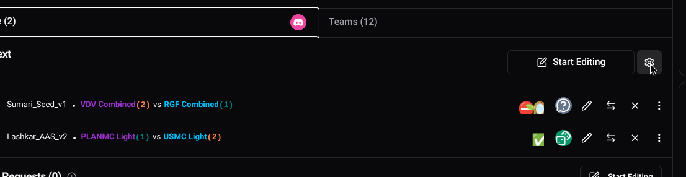

It has three tabs: _Filters_, _Repeat Rules_ and _Next Layer_.

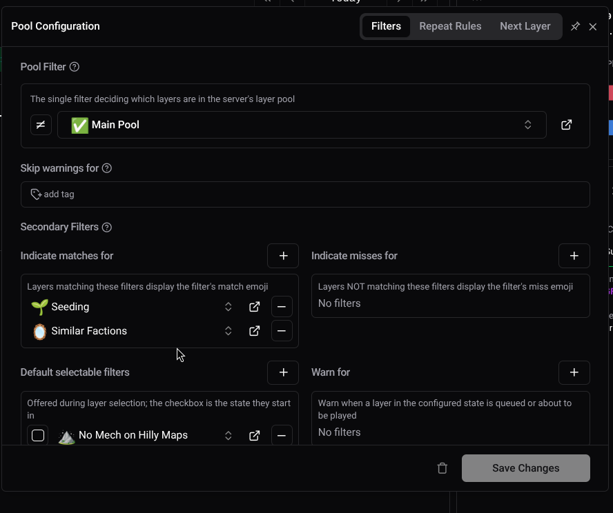

#### 8.3. The pool filter

_Pool Filter_ is the setting that matters most: the single filter deciding which layers are in the server's layer
pool. It is _Main Pool_ by default.

A layer the pool filter matches is _in-pool_, and one it does not match is _out-of-pool_. That status follows the
layer through the whole app:

- out-of-pool layers are hidden behind the pool toggle during layer selection
- only a user holding `queue:force-write` can queue one
- saving one warns the editor, and in-game admins are warned when one is about to be played
- autogenerated layers always come from the pool

The toggle in front of the filter decides whether matching layers are in-pool or out-of-pool.

#### 8.4. Match and miss indicators

A filter carries a name, a description, a _Match Indicator_ and a _Miss Indicator_. Each indicator has an
_Emoji_ and an _Alert Message_. Edit them from the filter itself:

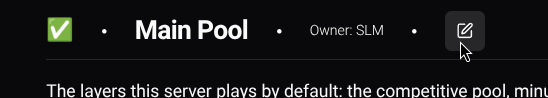
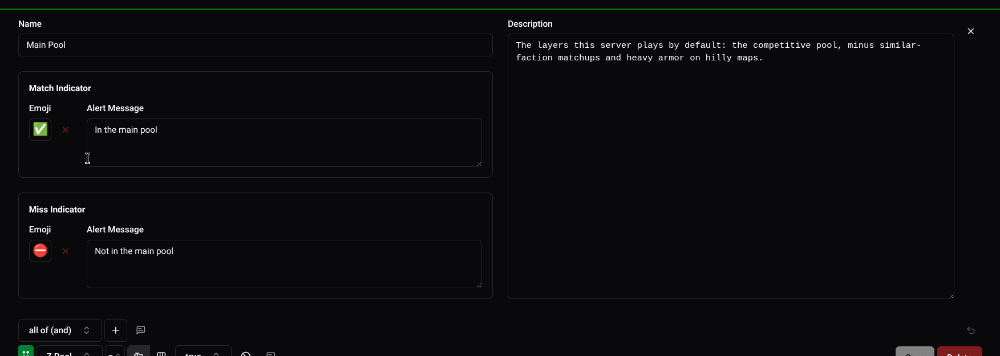

An emoji can be a standard one, or one from your discord server's emoji library:

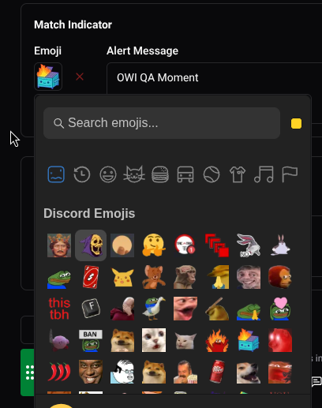

The pool filter needs all four configured, because they are what marks a layer as in-pool or out-of-pool
everywhere it appears. The queue shows the emoji beside the layer:

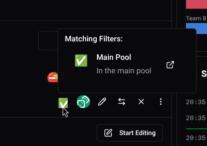

The pool filter is also enabled by default in the _Add Layers_ dialog:

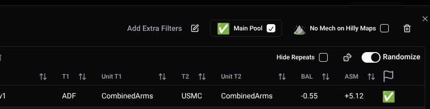

Anyone can turn it off, but only a user holding `queue:force-write` can save an out-of-pool layer. Queue one, or
edit a queued layer until it no longer matches, and SLM raises _Filter Warnings_ before it saves:

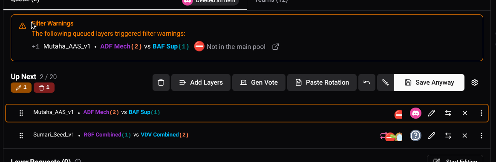

While the next layer carries a warning, SLM repeats it to in-game admins. To silence the warnings on one queue item,
tag the item and name that tag in _Skip warnings for_. The item still needs `queue:force-write` to save if it is
out-of-pool, and its indicators still display.

#### 8.5. Secondary filters

_Secondary Filters_ never decide whether a layer is in-pool. They add behaviour on top, and one filter can appear
in several of the lists at once.

| List                           | What it does                                                              |
| ------------------------------ | ------------------------------------------------------------------------- |
| _Indicate matches for_         | Matching layers display the filter's match emoji                          |
| _Indicate misses for_          | Layers that do not match display the filter's miss emoji                  |
| _Default selectable filters_   | Offered during layer selection, starting in the state you set here        |
| _Warn for_                     | Warn when a layer in the configured state is queued or about to be played |
| _Constrain generated pool for_ | Constrain autogenerated layers, on top of the pool filter                 |

_Constrain generated pool for_ is the one to set up first. When the queue runs out of layers, SLM generates one
from the pool, and the default _Main Pool_ is permissive. Naming a tighter filter here keeps generated layers
closer to what you want to play. Each entry is set to _Must match_ or _Must not match_.

#### 8.6. Next layer

The _Next Layer_ tab holds two settings, both off by default. They decide how SLM reacts when the server's next
layer changes underneath it.

_Override the next layer when it is set outside SLM_ covers the case where something other than SLM sets the next
layer, such as an in-game admin or another RCON tool. On, SLM sets it straight back to whatever the queue says. Off,
SLM adopts the change instead, and puts that layer at the front of the queue.

_Warn admins when the next layer changes_ sends every in-game admin the new next layer whenever it changes. A change
SLM overrides is not announced, so turning both on tells admins only about changes SLM accepted.

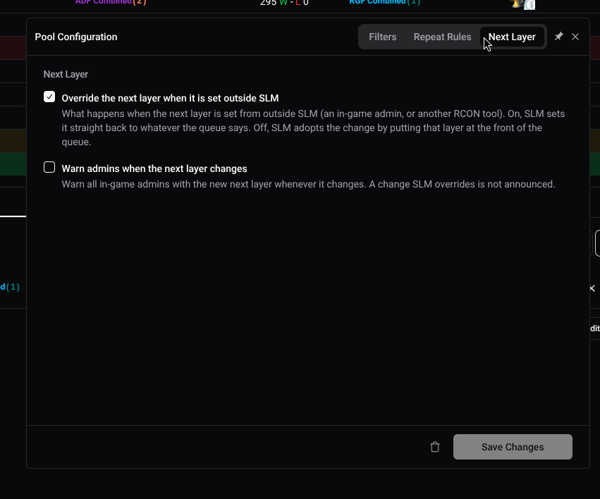

#### 8.7. Disabling SLM updates

SLM normally writes the next layer to the server over RCON. _Disable SLM Updates_, in the _Server Actions_ menu,
stops it. The queue still runs and tracks what is played; SLM just never sets the map itself, and stops sending the
recurring reminders and announcements that describe the queue as the rotation. Use it to run SLM alongside something
else that owns the rotation.

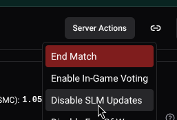

While updates are off, the queue panel carries an _SLM Updates Disabled_ alert naming who turned them off, and
_Re-enable SLM Updates_ puts them back. Both need `squad-server:disable-slm-updates`.

SLM also stands down on its own when Squad's built-in vote is deciding the next layer, or if it infers that voting has been turned on via `AdminEnableVoting 1`.

Instead, it will report that voting has been enabled, and disable updates to the next layer until explicitely toggled back on, which will disable voting.

#### 8.8. Repeat rules

A _repeat rule_ sets how soon a map, layer or faction may be played again, counting across both the queue and the
recent match history. Rules are per attribute, and they live on the _Repeat Rules_ tab.

These are the defaults:

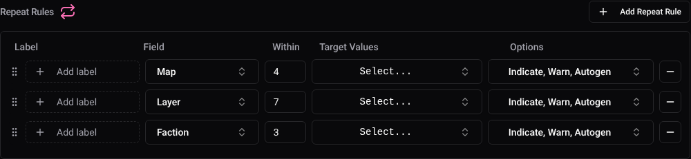

They treat a layer as a repeat when it reuses:

- its `Map` within 4 matches
- its `Layer`, which is the map, gamemode and version together, within 7 matches
- its `Faction`, on the same side, within 3 matches

A rule on a team-specific attribute such as `Faction` or `Unit` reads that side's own history, not both. One side can
still play a faction the other side played recently.

_Target Values_ narrows a rule to named values:

That rule covers Skorpo alone, over 10 matches. A _Within_ of 0 turns a rule off.

On its own a rule only marks the repeat, which the layer table can hide behind _Hide Repeats_. Two checkboxes
decide what else it does:

- _Warn_ warns the editor before saving a layer that breaks the rule, and warns in-game admins when one is about
  to be played.
- _Autogen_ applies the rule when autogenerating layers as well. It is on for all three defaults, and off for the
  Skorpo rule above.

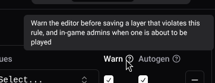
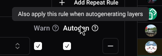

A repeat rule looks back only as far as the most recent seeding or training layer. A future version may let a rule
opt out of that.

### 9. Layer table

#### 9.1. Default displayed columns

The layer table can show more about each layer than it does by default, and each column it shows is another way to
filter. Configure the columns under _Layers > Layer Table_. They apply to the layers table and to every layer
select menu, such as the _Explore Layers_ and _Add Layers_ dialogs:

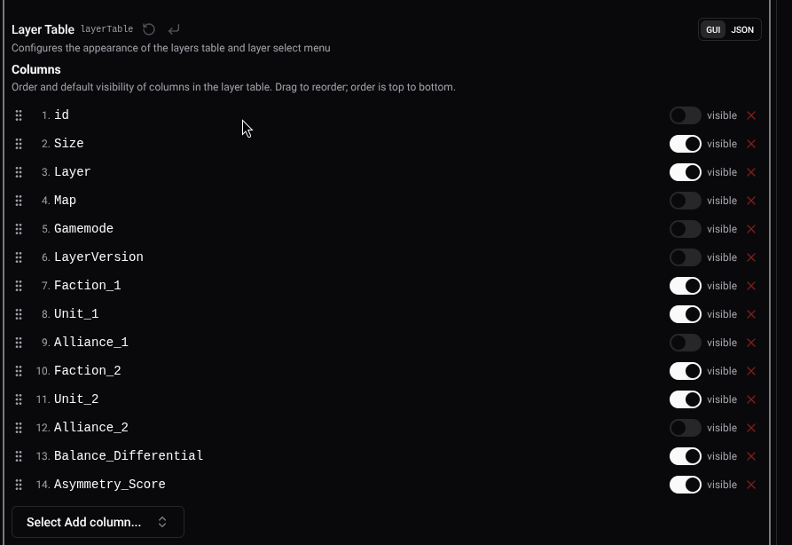

Drag a column to reorder it, and use its toggle to set whether it is visible by default. The same setting holds the
table's default sort and the extra comparison controls its filter menu offers.

See [layer_data.md](layer_data.md) for where this data comes from, and how to build your own.

#### 9.2. Randomization

_Layer Generation Weights_ controls how SLM picks layers at random. It covers layer generation, which runs when
the queue runs out of layers, vote generation, and the layer table's random sort.

Generation walks down a configurable pick order of layer columns and matchups:

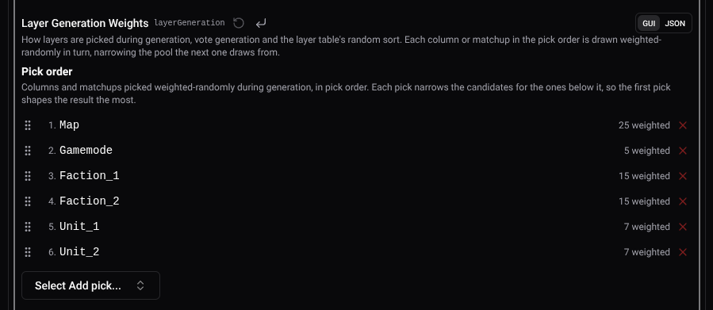

At each step it draws one value at random, using the weights you configure for that column, and the draw narrows
the pool the next step draws from:

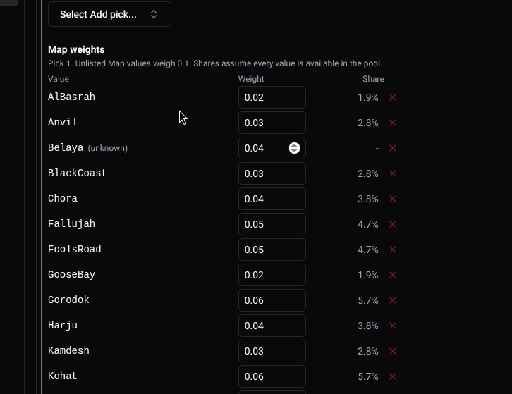

A value you do not list weighs 0.1. Matchups are unordered, so `[ADF, PLA]` and `[PLA, ADF]` are one entry.

Generation keeps going down the pick order until one layer remains, or until the pick order runs out, in which case
it picks one of the remaining layers at random.

The weights are relative, not probabilities. SLM normalizes them against the values actually available at pick time,
and a value with no layers left is never picked. Your background filtering and the values already picked both narrow
what remains, so configured weights do not map cleanly onto the distributions you end up seeing.
