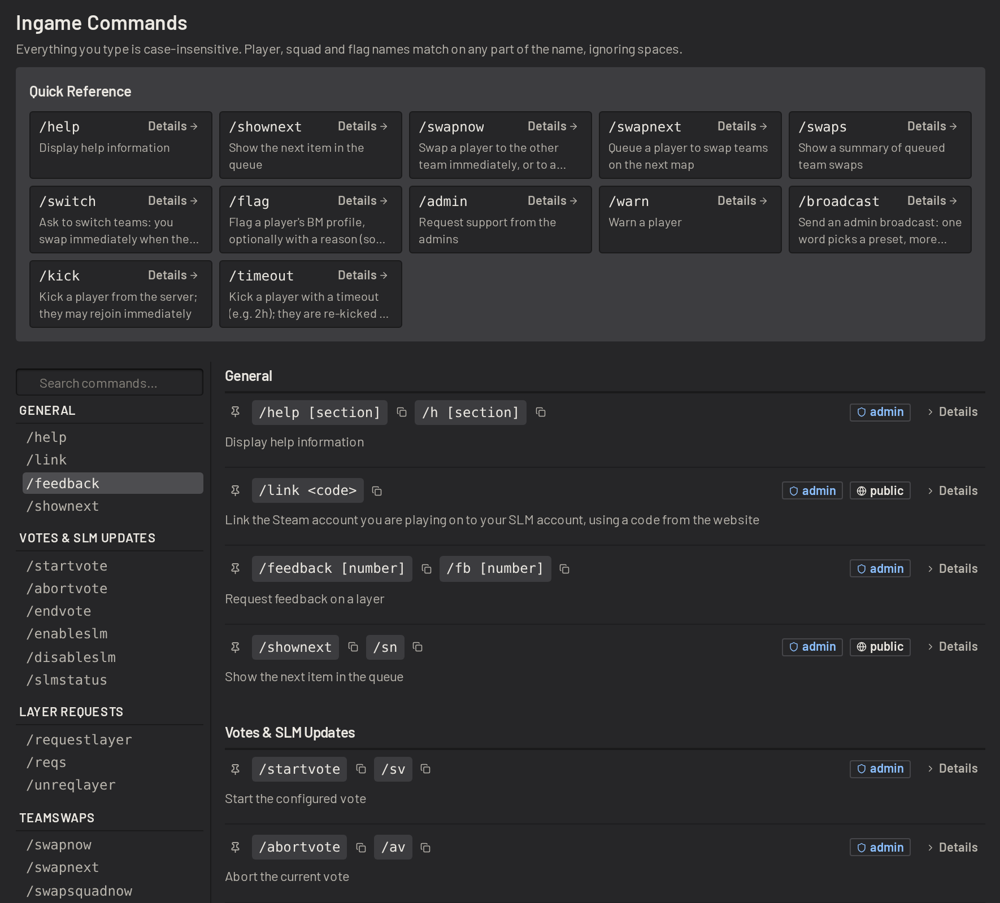
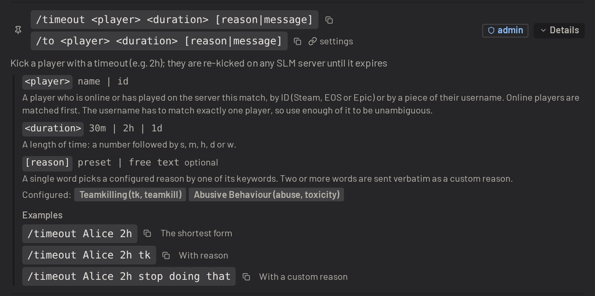
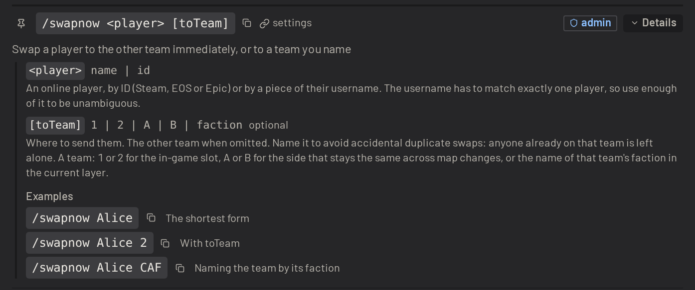
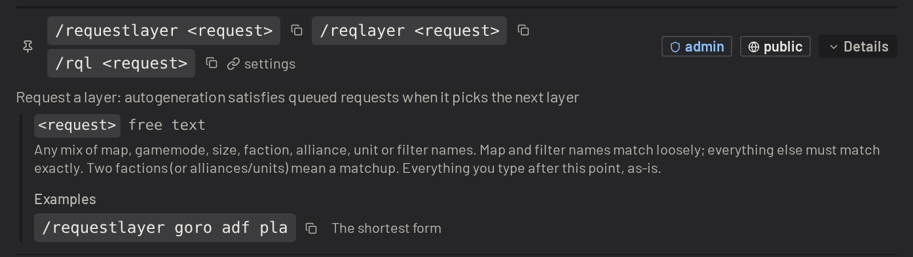
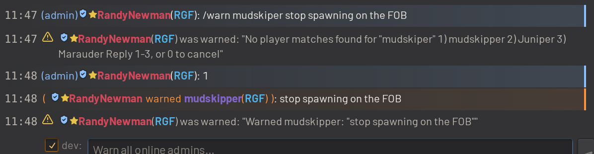

# In-game commands

Admins can use most of SLM from the game's chat: votes, swaps, warns, kicks, timeouts, broadcasts, flags, notes and
layer requests. Players can use the public commands, such as `/switch` to ask to switch teams, `/admin` to call for an
admin, and `/requestlayer` to request a layer. Each command runs with the permissions of the player who types it. See
[Permissions](player_management.md#permissions).

Type `/help` in game to list the commands. Everything typed is case-insensitive, and player, squad and flag names match
on any part of the name.

## The commands page

The _Commands_ page in your install lists every command. Pin the commands you use most to keep them in the quick
reference at the top of the page, or search for a command by name.

Click _Details_ on a command to see each of its arguments, the reasons configured for it, and examples to copy.

## Triggers and shortcuts

A _trigger_ is the word typed in chat to run a command. `/timeout` and `/to` are two triggers for the same command. Add
your own triggers for any command, including shortcuts with arguments filled in, such as `/to2h` for a two-hour
timeout. See [Command triggers](../guide/configuring/command_triggers.md).

Commands start with `/` by default. Add another prefix, such as `!`, to _Allowed Prefixes_ in the _In-game Commands_
settings, then give a command a trigger with that prefix, such as `!switch` beside `/switch`. Players who are used to
another tool's commands can then keep typing them. See
[Command prefixes](../guide/configuring/admin_actions.md#command-prefixes).

## Typo correction

When a word in a command matches nothing, or matches more than one thing, SLM asks which one was meant instead of
failing. SLM warns the player who typed the command with up to three numbered choices, the closest matches to what was
typed. Reply in the same chat with a number to run the command with that choice, or with `0` to cancel.

Typo correction covers player names, squads, teams, flags, action reasons, `/help` sections and the words of a layer
request. When a command has more than one word to correct, SLM asks about each in turn. Answer every question at once
by typing one number per question, such as `1 2`.

A choice expires after 45 seconds. Typing another command discards the pending choice.
