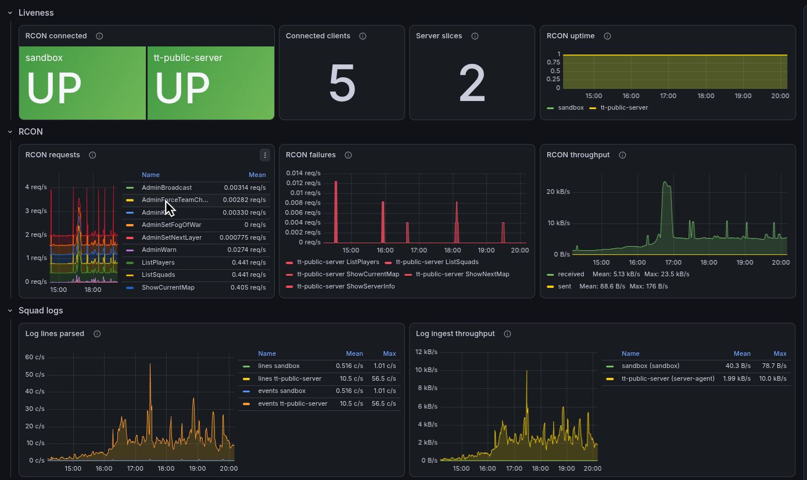

# Integrations and hosting

SLM integrates with the tools a Squad community already uses, such as Discord and BattleMetrics, and is easy to
host yourself.

## Integrations

### Discord

Users sign in with their Discord account. Grant SLM permissions to a Discord role, a Discord user or every member of
your server. Use your server's emoji to mark layers in the queue. Post a link to a selection of events from the
[activity feed or history page](server_monitoring.md#server-activity) in Discord, and SLM replies with the events
attached as a text file.

### BattleMetrics

SLM reads your organization's player flags and notes from BattleMetrics. Flag a player and leave a note from the
dashboard or in game, without opening BattleMetrics. A grouping mode can also sort players into groups by flag, for
balance.

### Steam and Squad Browser

SLM looks up the link that joins your server, through the Squad Browser API or through Steam. The dashboard then shows a
join button. Use it to open your server in Squad.

## Plugins

Plugins add commands, settings, behaviour, and UI to SLM. Install a plugin from the URL its author provides, then configure
and start the plugin on the settings page. SLM ships with three:

| Plugin           | What it does                                                              |
| ---------------- | ------------------------------------------------------------------------- |
| AFK Kicker       | Kicks AFK players when people are waiting in the queue, longest AFK first |
| Balance Triggers | Watches recent match outcomes and warns admins when they look one-sided   |
| Teamkill Warns   | Warns players when they have been teamkilled                              |

To write your own, see [writing_plugins.md](../developers/writing_plugins.md).

## Self-hosting

SLM ships as one Docker image, with its database stored in a file beside it. An install script sets up the compose
file and config, and SLM migrates its own database on upgrade. See [installing.md](../installing.md).

The compose file also includes an optional observability stack: Grafana, an OpenTelemetry collector and VictoriaMetrics.
Its preconfigured dashboards chart SLM's metrics, logs and traces, such as RCON traffic and failures, log ingestion and
the connection state of each server. See [installing.md](../installing.md#9-telemetry).

- **Many servers.** One install manages any number of Squad servers. Connect each one through its log file on disk,
  over SFTP for hosted servers, or through the [server agent](../guide/operations/server_agent.md), which keeps your RCON password on the
  game host.
- **Sandbox server.** A fresh install starts with an emulated Squad server, for learning SLM and testing settings
  without touching real players. See [sandbox_servers.md](../guide/operations/sandbox_servers.md).
- **Backups.** SLM backs up its database before every upgrade, and on a schedule if one is set, and can upload the
  backups over SFTP. See [backups.md](../guide/operations/backups.md).
- **Server console.** Read the RCON traffic and log lines exactly as SLM receives them, to find whether a problem is
  in the connection or in SLM. See [server_console.md](../guide/operations/server_console.md).
- **Monitoring.** The compose file runs Grafana with dashboards for each server's player count and join queue.
- **Mods.** SLM's layer catalog covers vanilla Squad and several popular mods. See
  [Mod support](layer_selection.md#mod-support).
