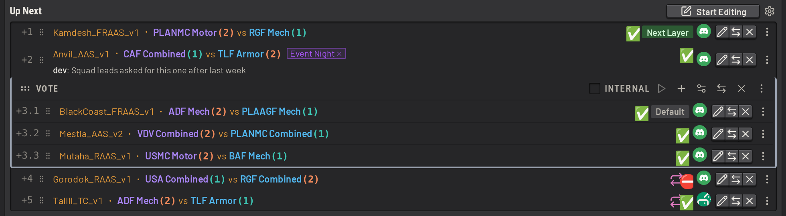
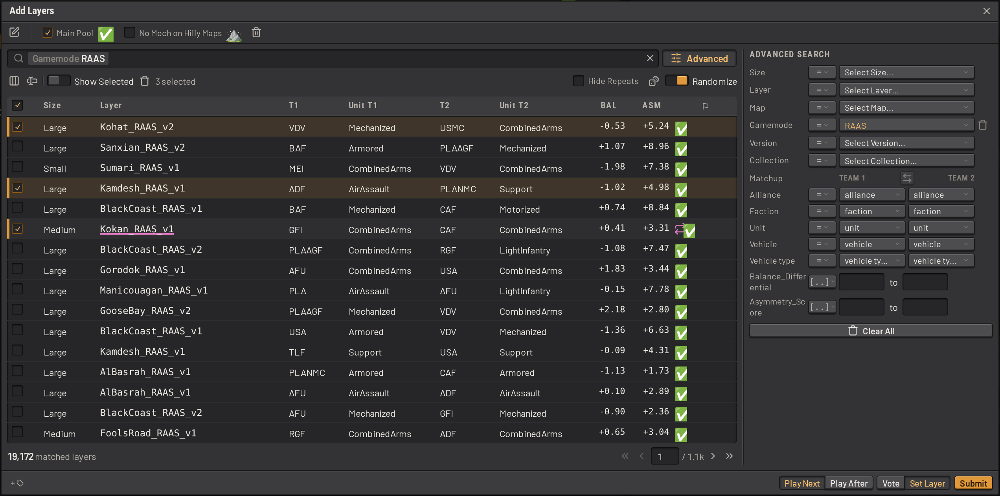
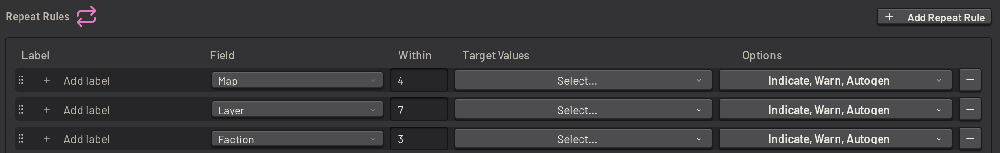
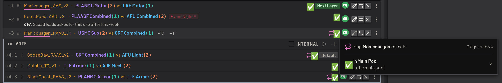
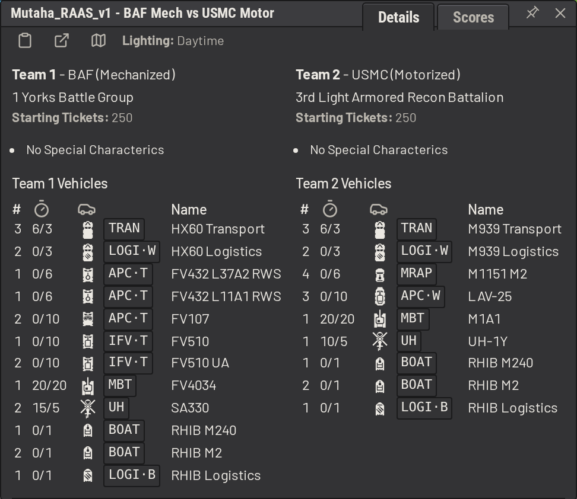
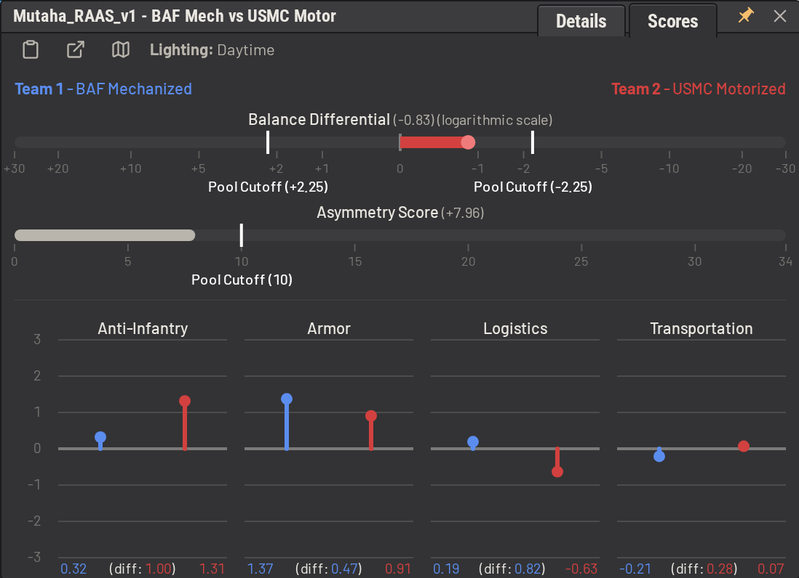
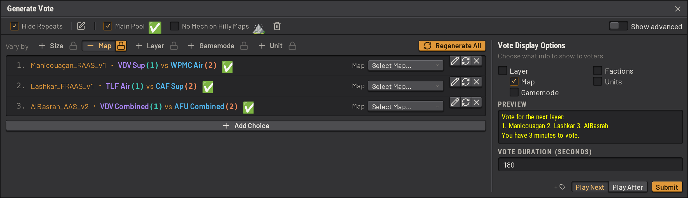
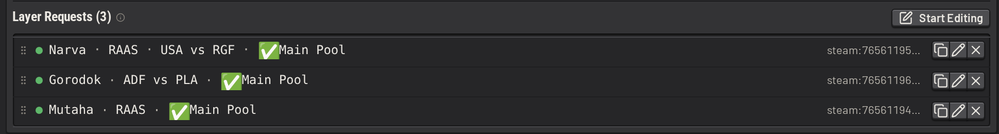
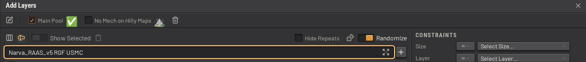

# Layer selection

SLM manages the layer rotation of one or more Squad servers. Admins work from a web app that signs in with Discord, and
from in-game commands. To install SLM, see [installing.md](../installing.md). If you're here to learn how to use SLM, try the in-app tutorials instead.

## The layer queue

The queue holds upcoming layers for the server, as a list of _queue items_. A queue item is either a single layer, or a
[vote](#votes) between several layers. When a queue item reaches the top, SLM sets the queue item's layer as the
server's next layer. For a vote, that layer is the vote's default choice until the vote ends, and the winning choice
after. When the queue runs out, SLM generates a layer from your layer pool, the set of layers your server may play, and
marks the generated layer with a dice icon. [Filters and the layer pool](#filters-and-the-layer-pool) describes the pool
below.

Click _Start Editing_ to change the queue. Several admins can edit the queue at once, and _Start Editing_ announces the
edit to the other admins. Layers can be added one at a time, as a generated vote, or pasted in as a whole rotation.
Queue items can hold colour-coded tags and freeform notes, for additional context.

## The layer selection dialog

Use the layer selection dialog to find layers to add to the queue. Narrow the full layer catalog with filters, named
rules that pick out a set of layers, such as "no mechanized units on hilly maps". [Filters and the layer
pool](#filters-and-the-layer-pool) describes filters below. Narrow the catalog further with constraints on map,
gamemode, factions, units and vehicles, or shuffle the list, weighted toward preferable layers. Each layer is marked
when it falls outside your pool or would break a [repeat rule](#repeat-rules). Add the selected layers as separate queue
items or as one vote.

## Filters and the layer pool

The base game offers about 730,000 layers, counting every map, gamemode, faction and unit combination, and this number
can balloon with additional mods. A _filter_ is a named expression that picks a subset of them out. Filters can be
composed by referencing each other to create more complex filters. Edit a filter in the builder, a visual editor, or as
text in YAML.

Filters define which layers admins can select by default and which layers SLM generates when the queue is empty, or
simply categorize layers. See
[Layer pool and filters](../guide/configuring/layer_pool.md).

## Repeat rules

A _repeat rule_ defines how soon a map, layer, faction or unit may be played again, counting both the queue and the
recent match history. The defaults catch the same map within 4 matches, the same layer within 7, and the same faction
on the same side within 3. Narrow a rule to named values, such as Skorpo alone over 10 matches.

SLM marks each layer that breaks a repeat rule. Hover over the marker  to see which rule the layer breaks. The repeated value is underlined in pink, on both the marked layer and
the earlier layer it repeats.

While editing the queue, click _Fix Repeats_ (the wand icon) to clear repeat warnings automatically. SLM reorders the
queue and swaps teams to clear as many warnings as possible, with as few changes as possible. Moving a layer one place
and swapping a layer's teams each count as one change. SLM never swaps the teams of:

- an Invasion, Destruction or Insurgency layer
- a layer whose swapped matchup falls outside the pool
- a layer with a tag that has _Prevent swaps_ turned on

A layer that another admin is editing stays where it is. The changes stay in the draft until the queue is saved.

## Layer details and scores

Each layer shows a balance score and an asymmetry score, and compares its two teams on anti-infantry, armor, logistics
and transportation. The scores are heuristics for how fair a matchup is likely to be. They come from a scoring system
created by community member ZERO, and refined through feedback and iteration on the TacTrig server.
Custom scoring can be built as well. See [layer_data.md](../guide/operations/layer_data.md).

## Votes

It's easy to create new votes on the fly with the _Gen Vote Dialog_.

Start a vote from the dashboard or in game with `/startvote`, or let SLM start the vote partway into a match. Players
vote by typing a choice's number in chat, and SLM broadcasts details of the vote to the server. Use an internal vote to
poll your admins alone through warns.

Each vote's duration can be set, along with which layer details voters see, such as the map, gamemode or factions.

## Squad's in-game voting

SLM also works on a server that uses Squad's own in-game voting system. When an in-game vote starts, or SLM infers that
voting was turned on with `AdminEnableVoting 1`, SLM stops setting the next layer, so SLM and the vote never fight over
it. The server's dashboard will show that an in-game vote is deciding the next layer.

## Layer requests

A layer request lets an admin ask for a layer with specific characteristics, without editing the queue by hand. Admins
make one in game by naming any mix of map, gamemode, faction, unit or specify any layer filter. Type `/reqlayer fallu raas usa rgf` to
request Fallujah RAAS with USA against RGF. When the queue runs out of deliberately queued layers, SLM generates the next
layer from the requests. SLM's autogeneration logic will attempt to satisfy as many requests as possible, such that if one admin requests WPMC, and another suggests Narva, the generated layer config might be on Narva and include WPMC.

## Mod support

SLM's layer catalog currently covers vanilla Squad and three mods: SuperMod, Resurgence and Galactic Contention. Each layer's
_Collection_ column records whether the layer is vanilla (`OWI`) or which mod it comes from, so a filter can include or
exclude a whole mod.

In each server's settings, configure the mods that server has installed. A custom layer dataset can also be loaded in
place of the built-in one, with other mods, your own scoring or extra columns. See [layer_data.md](../guide/operations/layer_data.md).

A layer the catalog does not know, such as one from a mod SLM does not cover, can still be queued. In the _Add Layers_
dialog, click the _Show Raw Input_ icon  and type the
layer in the format `AdminSetNextLayer` takes, such as `Narva_RAAS_v1 RGF USMC`.

