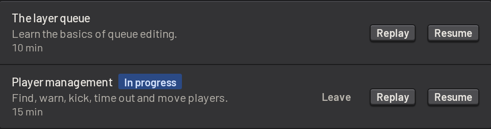
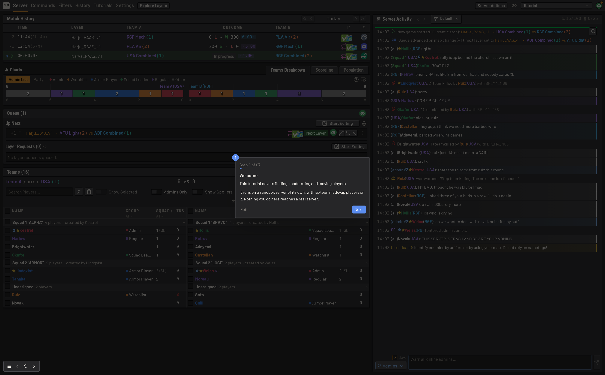
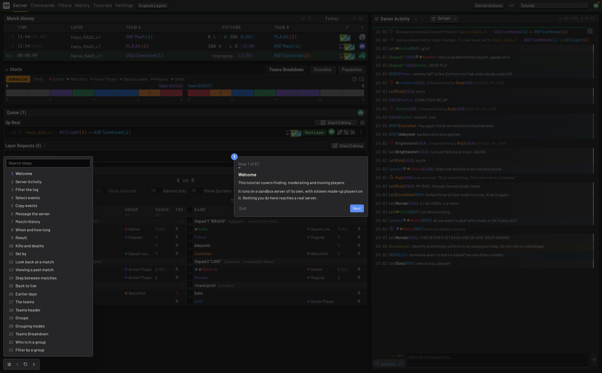

# Learning SLM

SLM is learned inside the app, by using it. Guided tutorials teach the server dashboard, and a sandbox server gives
admins somewhere to practise.

## Tutorials

The tutorials walk through the server dashboard step by step. Open _Tutorials_ from the nav bar. SLM also offers them
the first time a user opens a server's dashboard.

| Tutorial          | Length | Covers                                                                              |
| ----------------- | ------ | ----------------------------------------------------------------------------------- |
| The layer queue   | 10 min | reading and editing the queue, picking layers, filters and repeat rules, generation |
| Player management | 15 min | the activity log, match history, teams and groups, warns, kicks, timeouts and swaps |



Each tutorial runs on a sandbox server of its own, with sixteen made-up players who chat, fight and teamkill. Nothing
done in a tutorial reaches a real server. Each step highlights one part of the dashboard and explains it. Some steps
ask for an action, such as warning a player or adding a layer, and wait until it is done.



The controls in the bottom corner move between steps, reset the current step, or open the contents. Search the
contents to jump straight to a topic.



Leaving the dashboard pauses a tutorial. Resume it later from the _Tutorials_ page, or replay one already finished.
Follow the tutorials on a desktop, with a mouse and keyboard.

## Practising on the sandbox server

A fresh install comes with a server named _Sandbox_, attached to an emulated Squad server. Use it to try the queue,
votes and player actions without affecting real players. See
[Sandbox servers](../guide/operations/sandbox_servers.md).

## Tooltips and the commands page

Tooltips can be found throughout the app. Hover over an unfamiliar button, icon or label to see more about it. The
_Commands_ page lists every in-game command and how to use it. See [In-game commands](ingame_commands.md).

## Trying SLM without installing it

Run a demo instance with no authentication:

```sh
docker run --rm -p 127.0.0.1:3000:3000 -e DEMO=1 ghcr.io/tactrigsds/squad-layer-manager:latest
```
