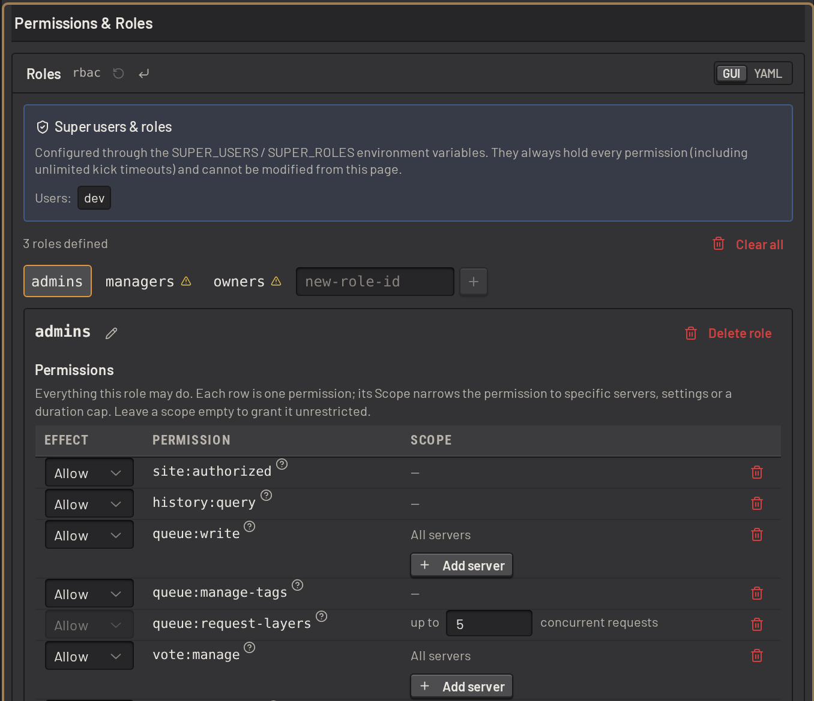

# Permissions and access control

SLM decides what each person may do through roles (role-based access control, or RBAC). A role allows or denies a set
of permissions, and is assigned to the people who should hold them, in SLM or in game.
[Permissions and users](../guide/configuring/permissions.md) describes how to set roles up.

## Users and players

SLM checks permissions for two kinds of people:

- A _user_ signs in to the web app with their Discord account.
- A _player_ uses [in-game commands](ingame_commands.md) on a server SLM manages.

A user can link their Discord account to their in-game account. The permissions from both then combine for every
action.

## Roles

A role allows or denies each of its permissions. A denial overrides an allow from any other role, so a role can carve
an exception out of a wider grant. A permission can be scoped to named servers.

A role can also cap an action, such as the longest timeout its members may give or how many layers they may request.

A fresh install comes with three roles:

| Role       | Holds                                                                                             |
| ---------- | ------------------------------------------------------------------------------------------------- |
| `admins`   | day-to-day operation: the queue, votes, filters, and warning, broadcasting to and kicking players |
| `managers` | everything `admins` holds, plus most settings, enabling servers and restarting SLM                |
| `owners`   | every permission                                                                                  |

## Assigning roles

Assign a role to any mix of:

- a Discord user, a Discord role, or every member of your Discord server
- the admins of an admin list, on the servers that use that list
- the members of a group in an admin list, such as a reserve-slot whitelist

Settings access is granted the same way, down to single settings. A role can edit the vote settings and nothing else,
or every server setting except the connection details. A server's RCON and SFTP details have a permission of their
own.

A user can only grant permissions they hold. SLM refuses a change to a role, an assignment or an admin list that would
grant a permission the user saving it lacks.

## Checking permissions

Every user can open the permissions dialog from their account menu to see what they hold, grouped by role or by
permission, and which role granted each one.

Turn on _Simulate_ to switch roles off and see the app as someone who holds fewer of them. A simulation only removes
access, and runs only in that browser: the server still checks real permissions on every action.

