# Monitoring and history

SLM records what happens on your servers. Follow the live match in the activity feed, chart the teams, the score and
the player count, and search every past event, player and match.

## Server activity

The activity feed records events from the Squad server and from SLM as they happen. SLM lays the events out to be easy
to scan, and collapses repeats of some noisy events into one line. Filter the feed further to the relevant events.

Click an event's time to start a selection, and Shift+click another to extend the selection. Right-click the selection
to copy the events as text, or to copy a link to them.

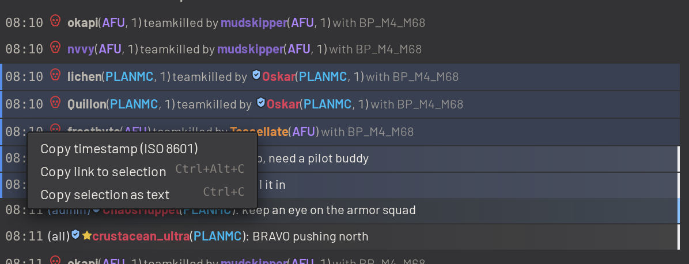

### Messaging admins and players

Use the chat box at the bottom of the activity feed to message the server without joining the game. Pick a target from
the chat box's menu: warn every online admin, broadcast to the whole server, or warn the players selected in the teams
panel. A checkbox beside the menu prefixes the message with your name.

## Match history

The match history lists each match's layer, length, outcome and who set it. Open a match to read its log and how the
teams were made up, or drag the match into the queue to play its layer again.

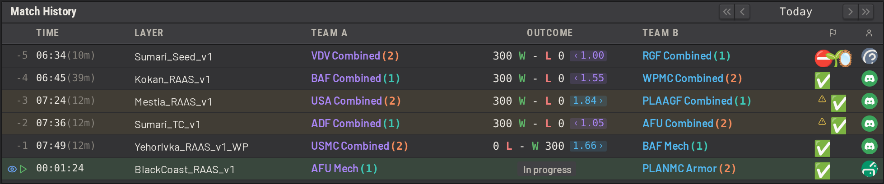

The activity feed and the match history each fill a tab of their own on a phone.

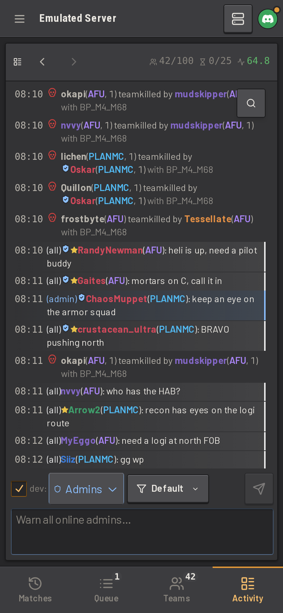
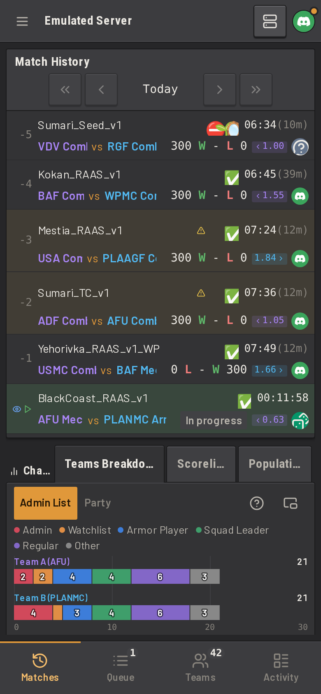

## Charts

The _Charts_ panel displays charts of the live match. When a match is opened from the match history, the panel displays
that match instead, under a banner naming it. Use the button beside a chart's help icon to open the chart in a window of
its own, at the size it has in the panel.

### Teams breakdown

The _Teams Breakdown_ chart counts each team's players by group of the chosen grouping mode. A grouping mode sorts
players into groups, such as by admin list group or BattleMetrics flag (see
[Teams and balance](player_management.md#teams-and-balance)). Click a segment to filter the teams panel to that group.

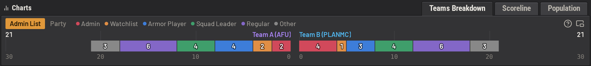

### Scoreline

The _Scoreline_ chart lists each team's tickets, kills, deaths and wounds, and plots kills, deaths or the kill lead
across the match. The kill lead is how far one team's kills are ahead of the other's, shaded in the leading team's
colour.

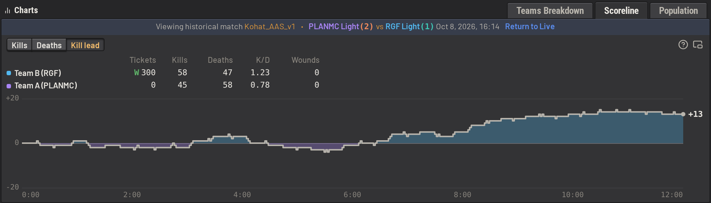

### Population

The _Population_ chart plots how many players were on the server over time. Pick _This match_ for the match the panel
displays, or _6h_, _24h_ or _7d_ for every match in that time. Pick _Activity_ to split the players into active and idle
players (see [Idle players](../guide/configuring/players.md#idle-players)), or _Teams_ for a line per team. Pick _Max
pop_ to scale the chart to your server's player cap, or _Fitted_ to scale it to the players drawn. A solid line marks
where a match started, and a dashed line where its round ended. Click a match on the chart to open it in the panel and
in Server Activity.

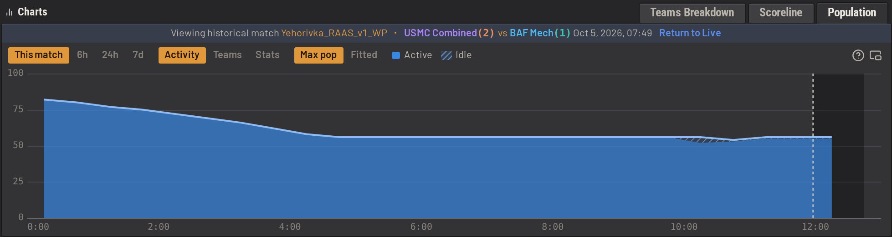

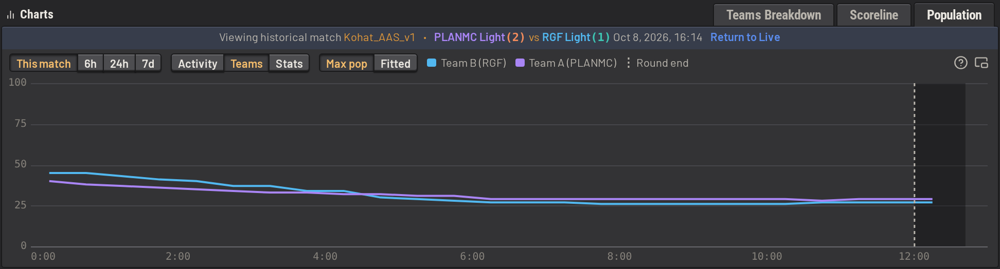

Pick _Stats_ for figures over the same time: the peak and lowest player count, the average and median, how long the
server was full, the share of idle players, the gap between the teams, joins and leaves per hour, and the churn rate,
the share of the players who leave each hour.

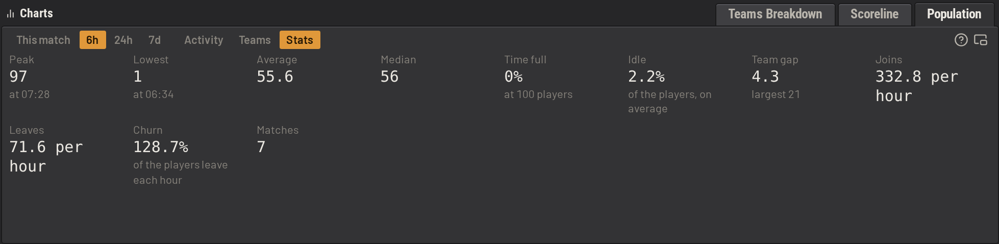

## The history page

Use the history page to search past events, players and matches by player, time, event type, layer, outcome and more.
Save a query for yourself or share the query with other admins, and export results as text or CSV. Select events on
the history page as in the activity feed.

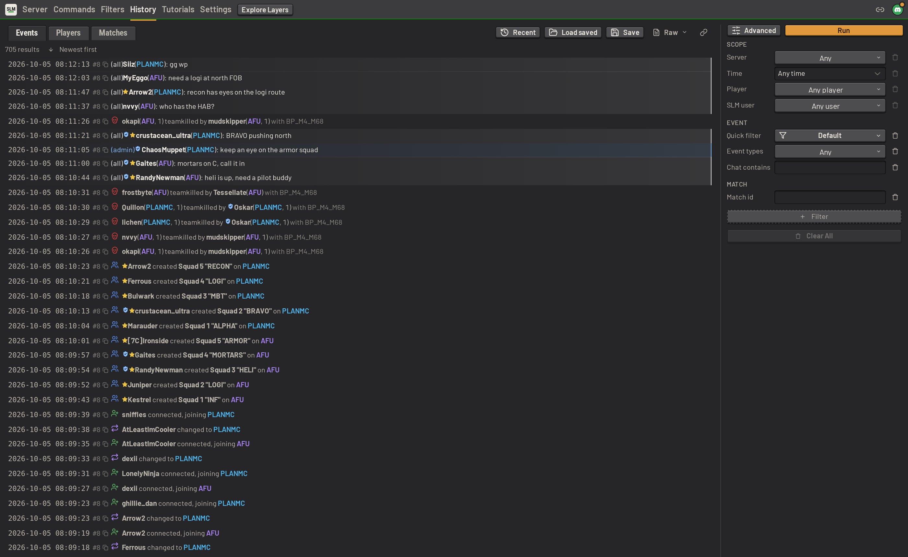

### Players and matches

The _Players_ and _Matches_ tabs group the events a query finds by player or by match. Each row counts the events
behind it. Expand a row to read those events in place.

A player row lists the player's Steam and EOS IDs, how many matches they played, how many chat messages they sent, and
when they were last seen. Use _Min matches_ to find regulars. Add an event type and a time to find, for example, every
player who was warned in the last week.

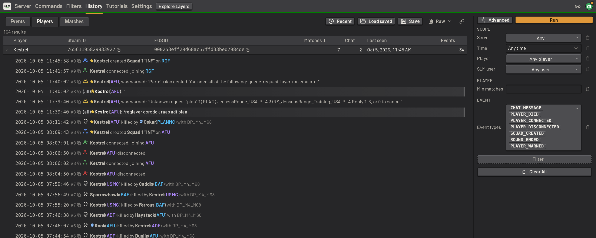

A match row lists the match's layer, outcome, ticket and kill differences, length, and who set the layer. Narrow the
matches by outcome, ticket difference, length, kills or map, such as to find every one-sided match on a map.

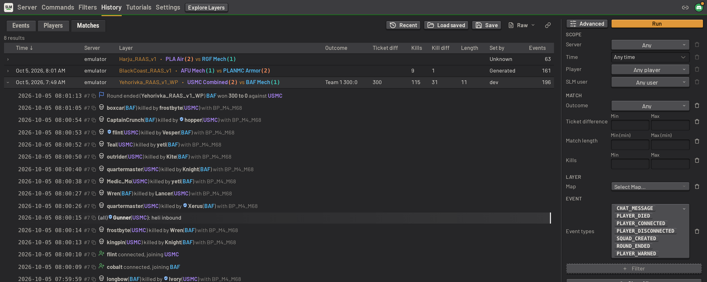

Post a link to a selection of events in Discord, and SLM replies with the events attached as a text file. See
[Discord](integrations_and_hosting.md#discord).
