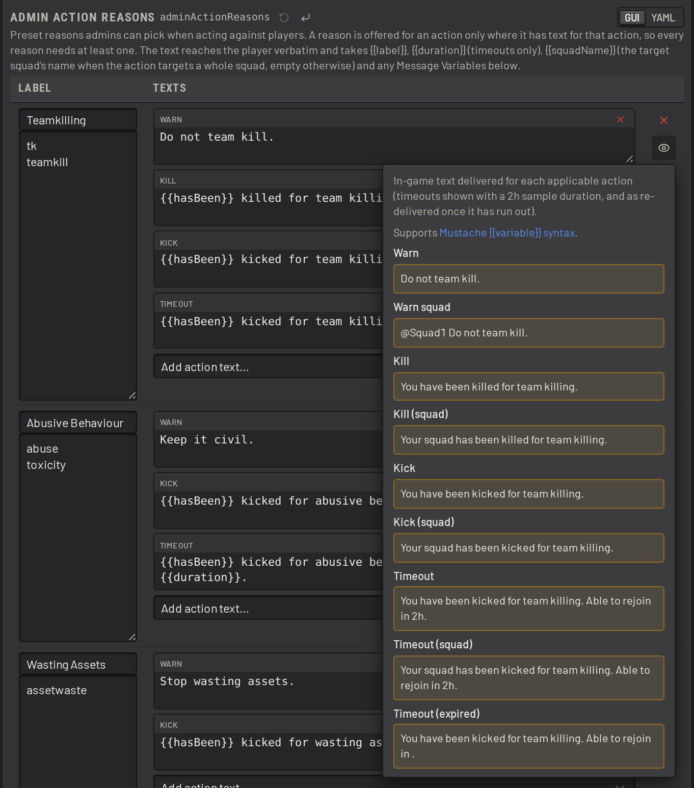
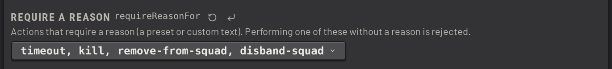
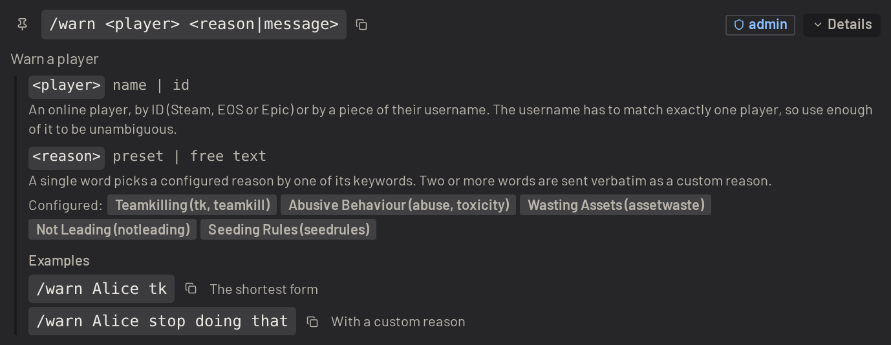
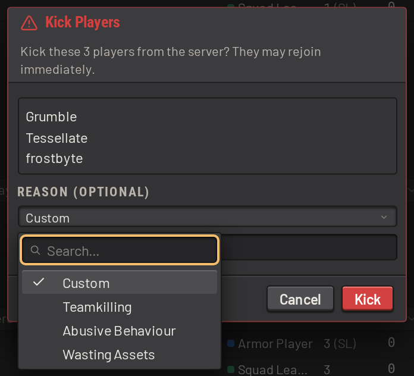
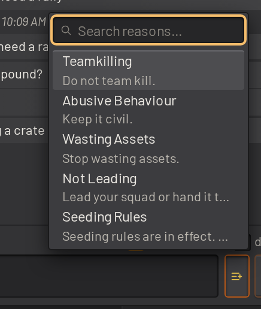
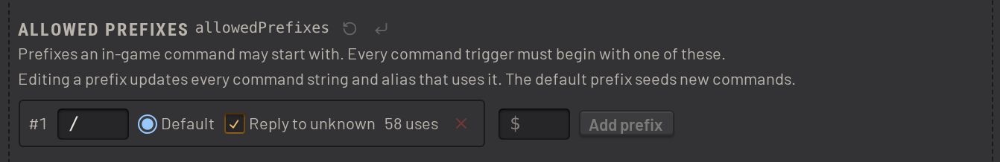

# Admin actions and commands

These settings control the messages SLM sends to players, and how admins reach SLM's commands in game.

## Warns, broadcasts and admin actions

The _Warns & Broadcasts_ section holds the messages SLM shows to players: admin warnings, kicks, broadcasts, and
more.

Configure reasons such as teamkilling, spamming or soloing under _Admin Action Reasons_. Each reason carries one
text per action, where an action is a warn, a broadcast, a kick, a timeout, and so on:



Write the texts as [mustache](https://mustache.github.io/mustache.5.html) templates. _Message Variables_ in the same
section holds reusable snippets. A message variable can be used in several texts, or inside another message variable.

When an action targets a whole squad, `{{squadName}}` holds the squad's name. For a single player it is empty, so
a section can switch the wording:

```
{{#squadName}}Your squad has been warned for{{/squadName}}{{^squadName}}You have been warned for{{/squadName}}
teamkilling.
```

Put the section inside a message variable to reuse it across reasons.

_Require a Reason_ makes a reason mandatory for the actions listed in it:



The user can still type a freeform reason instead of choosing a configured one.

Admins then use a configured reason with the in-game `/warn`, `/broadcast`, `/kick`, `/timeout` and other commands,
as long as that reason has text for the action: a reason with no kick text cannot be used to kick.



Reasons are also selectable when an action is performed from the interface:




## In-game commands

SLM has a large set of in-game commands. The commands page in your own install documents each command and how to use
it:


### Command prefixes

By default, every command has the prefix `/`. Change this prefix, or add another, in _Allowed Prefixes_, under
_Advanced_ in the _In-game Commands_ section:



If an existing prefix is changed, SLM moves every [trigger](#command-triggers) with that prefix to the new one.

> [!TIP]
> Pick a prefix that does not collide with existing commands. Some SLM commands behave differently from their squadjs
> counterparts, which confuses users. Disable the old command instead, with a message that points users at the SLM
> one.

### Command triggers

An in-game command runs from one of its _triggers_: the strings listed against it under
_Settings > In-game Commands_. `/timeout` and `/to` are two triggers for the same command, and typing either takes
the command's arguments exactly as written.

A trigger can also pin some of those arguments, which turns it into a shortcut. Give `/to2h` the `args` template
`{{arg1}} 2h {{rest}}`, and typing `/to2h Alice spamming` runs `/timeout Alice 2h spamming`. This is what command
aliases used to be.

See [command_triggers.md](command_triggers.md) for the template syntax, what happens to words the caller leaves out,
and the limits on what a trigger can reach.
