# Layer pool and filters

These settings decide which layers admins may queue and SLM may generate, and how the layer table marks and shows layers.

## Filters

The base game has about 730,000 possible layers, counting every map, gamemode, faction and unit combination, or
about 2.7 million with the popular mods. A _filter_ is a named expression that picks a subset of them out. SLM
ships with a few, listed in the filters index:

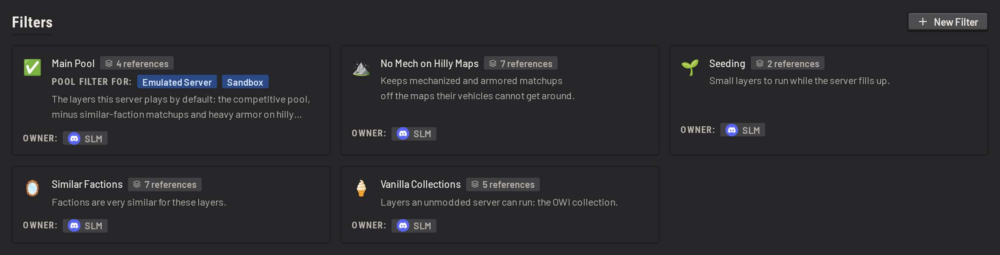

Open one to see the expression that decides what it matches:

Each condition is one line, written out. Click a line to edit it, then click _Done_ or press _Escape_. Only one line is
open at a time. The buttons for commenting, copying and removing a line appear when the pointer is over it.

The block at the top sets how the conditions under it combine. The four block types are _all of_, _any of_,
_none of_ and _not all of_. Opening one also names the operation it stands for. _No Mech on Hilly Maps_ uses
_not all of_, so a layer matches unless both of these hold:

- `Map` is Manicouagan, Skorpo or Lashkar
- `Unit (Either)` is Mechanized or Armored

A filter does nothing on its own: other settings point at it, and one filter can be used inside another.
_Main Pool_ is built out of two of the others:

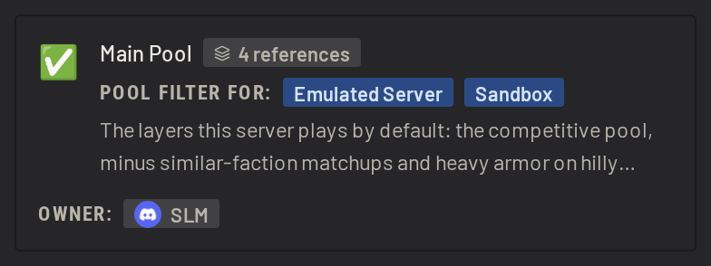
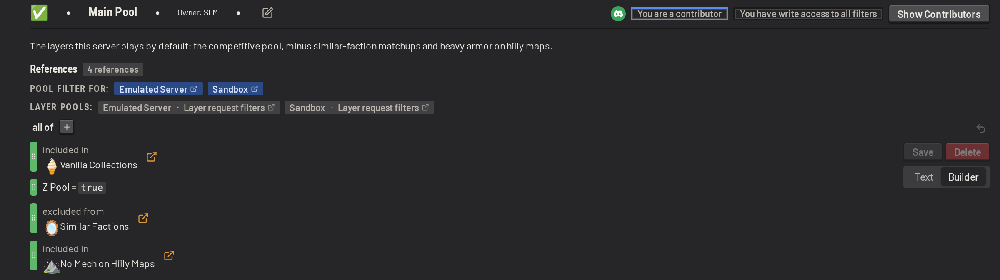

It uses _all of_, so a layer has to meet every one of:

- `Z_Pool` is true, shown as `Z Pool` in the builder. This is one of the extra columns that ship with SLM's layer
  data, and it marks the competitive pool. See [layer_data.md](../operations/layer_data.md).
- the layer is excluded from _Similar Factions_
- the layer is included in _No Mech on Hilly Maps_

Switch a filter between _Builder_ and _Text_. Use the text view to edit the expression as text, which is easier for
changes that take a line at a time in the builder, such as changing how the conditions nest. Click _Reformat_ to tidy
the text up. A line's comment shows up in the text view as a `#` line above it, and a `#` line written there becomes the
comment on the line below.

## Pool configuration

_Pool Configuration_ decides which layers count as playable, which ones raise warnings, and how soon a map, layer
or faction may be played again.

Reach it from the _Pool Configuration_ page in the settings, or from the gear icon above the layer queue. The gear is
the usual route:

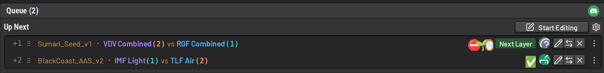

It has three tabs: _Filters_, _Repeat Rules_ and _Next Layer_.

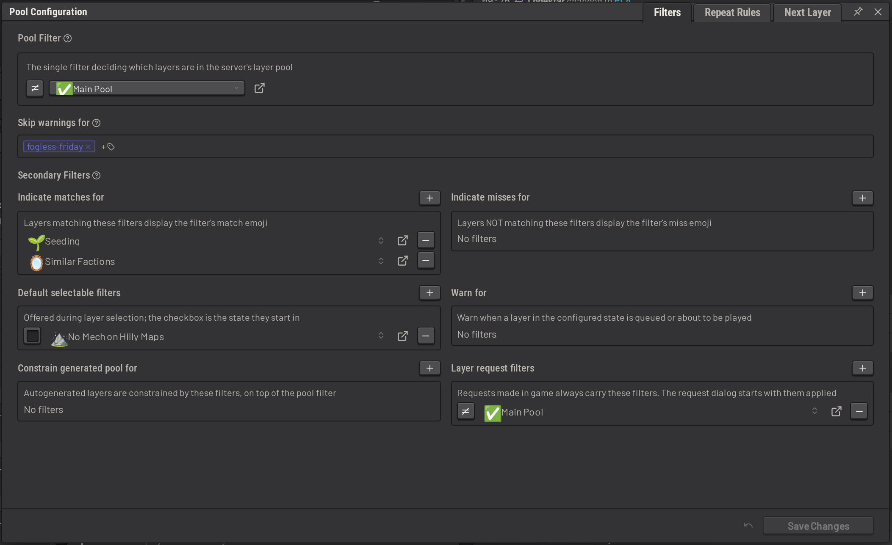

## The pool filter

_Pool Filter_ is the most important setting. It is the single filter that decides which layers are in the server's
layer pool. It is _Main Pool_ by default.

A layer the pool filter matches is _in-pool_, and one it does not match is _out-of-pool_. That status follows the
layer through the whole app:

- out-of-pool layers are hidden behind the pool toggle during layer selection
- only a user holding `queue:force-write` can queue one
- saving one warns the editor, and in-game admins are warned when one is about to be played
- autogenerated layers always come from the pool

Use the toggle in front of the filter to set whether matching layers are in-pool or out-of-pool.

## Match and miss indicators

A filter carries a name, a description, a _Match Indicator_ and a _Miss Indicator_. Each indicator has an
_Emoji_ and an _Alert Message_. Edit them from the filter itself:

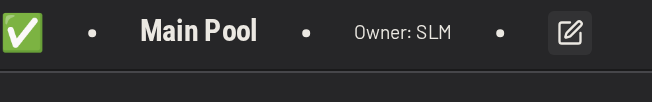
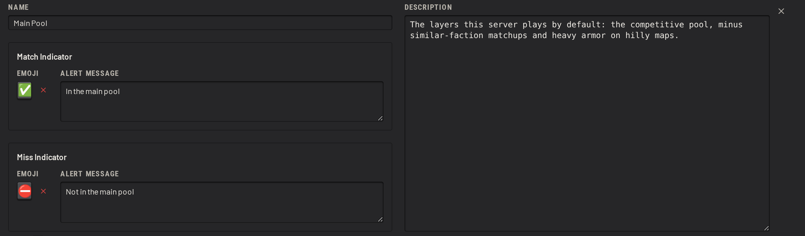

An emoji can be a standard one, or one from your discord server's emoji library:

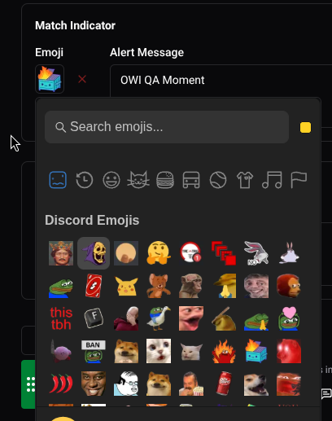

The pool filter needs all four configured, because they are what marks a layer as in-pool or out-of-pool
everywhere it appears. The queue shows the emoji beside the layer:

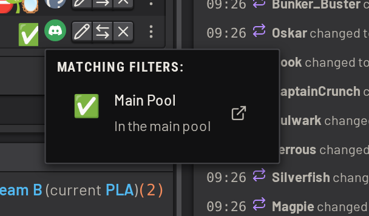

The pool filter is also enabled by default in the _Add Layers_ dialog:

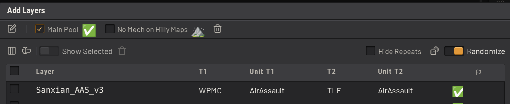

Anyone can turn it off, but only a user holding `queue:force-write` can save an out-of-pool layer. Queue one, or
edit a queued layer until it no longer matches, and SLM raises _Filter Warnings_ before it saves:

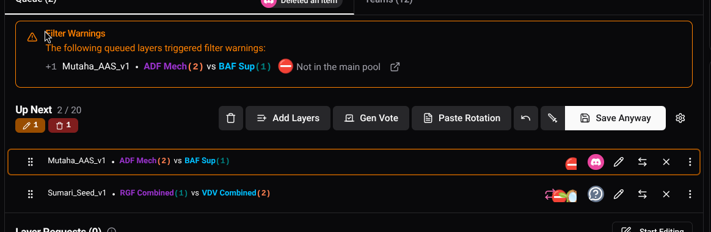

While the next layer carries a warning, SLM repeats it to in-game admins. To silence the warnings on one queue item,
tag the item and name that tag in _Skip warnings for_. The item still needs `queue:force-write` to save if it is
out-of-pool, and its indicators still display.

## Secondary filters

_Secondary Filters_ never decide whether a layer is in-pool. They add behaviour on top, and one filter can appear
in several of the lists at once.

| List                           | What it does                                                              |
| ------------------------------ | ------------------------------------------------------------------------- |
| _Indicate matches for_         | Matching layers display the filter's match emoji                          |
| _Indicate misses for_          | Layers that do not match display the filter's miss emoji                  |
| _Default selectable filters_   | Offered during layer selection, starting in the state set here            |
| _Warn for_                     | Warn when a layer in the configured state is queued or about to be played |
| _Constrain generated pool for_ | Constrain autogenerated layers, on top of the pool filter                 |
| _Layer request filters_        | Constrain layer requests                                                  |

_Constrain generated pool for_ is the one to set up first. When the queue runs out of layers, SLM generates one from the
pool, and the default _Main Pool_ is permissive. Naming a tighter filter here keeps generated layers closer to what your
community wants to play. Each entry is set to _Must match_ or _Must not match_.

_Layer request filters_ apply to requests players make in game. They are always added to the request. In the dashboard,
the request dialog starts with them applied, and they can be turned off for one request.

## Layer tags

Individual layers in the layer queue can be tagged. Layers with certain tags can be configured to skip warnings:

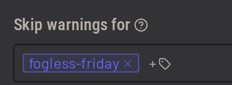
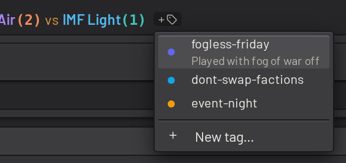

## Layer table columns

The layer table can show more about each layer than it does by default, and each column it shows is another way to
filter. Configure the columns under _Layers > Layer Table_. They apply to the layers table and to every layer
select menu, such as the _Explore Layers_ and _Add Layers_ dialogs:

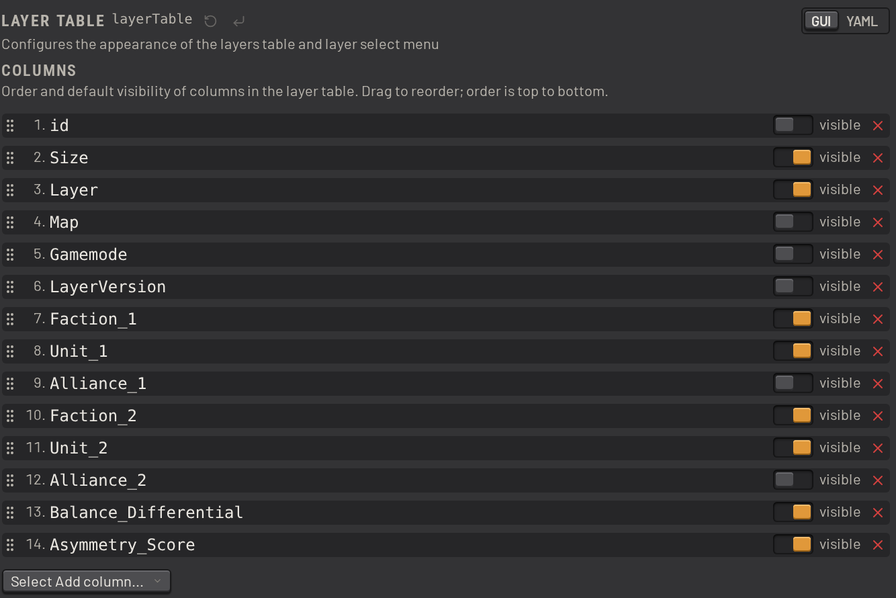

Drag a column to reorder it, and use its toggle to set whether it is visible by default. The same setting holds the
table's default sort and the extra comparison controls its filter menu offers.

See [layer_data.md](../operations/layer_data.md) for where this data comes from, and how to build your own.
