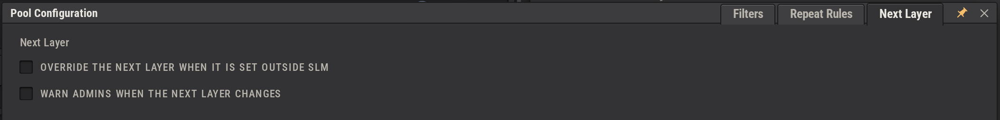
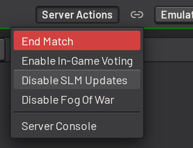
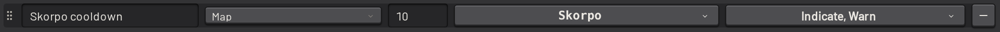
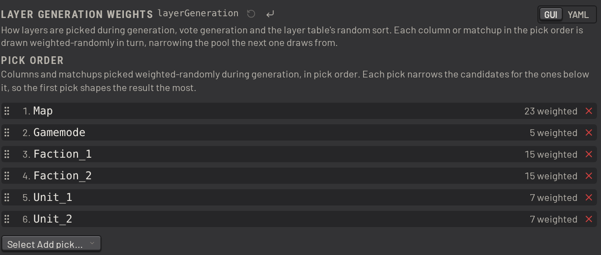
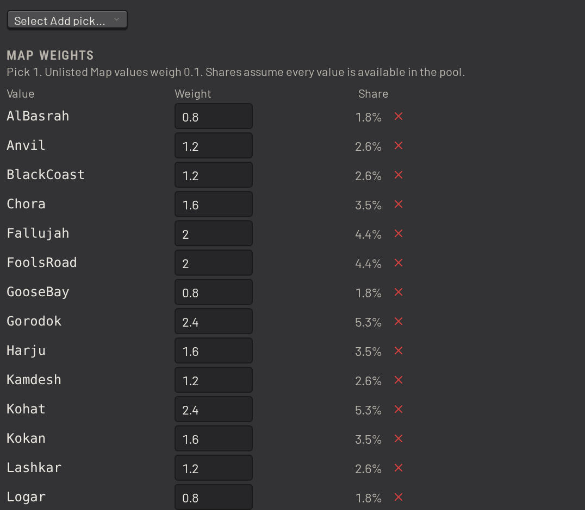

# Layer rotation

These settings decide what SLM plays next: the next layer, the repeat rules, and how SLM picks layers at random.

## Next layer

The _Next Layer_ tab holds two settings, both off by default. They decide how SLM reacts when the server's next
layer changes underneath it.

_Override the next layer when it is set outside SLM_ covers the case where something other than SLM sets the next
layer, such as an in-game admin or another RCON tool. On, SLM sets it straight back to the next layer in the queue.
Off, SLM adopts the change instead, and puts that layer at the front of the queue.

_Warn admins when the next layer changes_ sends every in-game admin the new next layer whenever it changes. A change
SLM overrides is not announced, so turning both on warns admins only about changes SLM accepted.

## Disabling SLM updates

SLM normally writes the next layer to the server over RCON. Use _Disable SLM Updates_, in the _Server Actions_ menu,
to stop SLM writing the next layer. The queue still runs and tracks what is played. SLM never sets the map itself,
and stops sending the recurring reminders and announcements that describe the queue as the rotation. Disable
updates to run SLM alongside something else that owns the rotation.

While updates are off, the queue panel carries an _SLM Updates Disabled_ alert naming who turned them off. Use
_Re-enable SLM Updates_ to turn them back on. Both need `squad-server:disable-slm-updates`.

SLM also stands down on its own when Squad's built-in vote is deciding the next layer, or when it infers that
voting was turned on with `AdminEnableVoting 1`. It reports that voting is enabled, and stops updating the next
layer until someone turns updates back on. Turning them back on disables voting.

## Repeat rules

A _repeat rule_ sets how soon a map, layer or faction may be played again, counting across both the queue and the
recent match history. Each rule covers one attribute. Set them on the _Repeat Rules_ tab.

These are the defaults:

They treat a layer as a repeat when it reuses:

- its `Map` within 4 matches
- its `Layer`, which is the map, gamemode and version together, within 7 matches
- its `Faction`, on the same side, within 3 matches

A rule on a team-specific attribute such as `Faction` or `Unit` reads that side's own history, not both. One side can
still play a faction the other side played recently.

Use _Target Values_ to narrow a rule to named values:

That rule covers Skorpo alone, over 10 matches. A _Within_ of 0 turns a rule off.

A rule always hides its repeats behind the layer table's _Hide Repeats_. _Options_ decides what else it does:

- _Indicate_ marks a layer that breaks the rule wherever it is shown: the repeat icon on the queue item and in the
  layer table, and the underline on the field that repeats.
- _Warn_ warns the editor before saving a layer that breaks the rule, and warns in-game admins when one is about
  to be played.
- _Autogen_ applies the rule when autogenerating layers as well. It is on for all three defaults, and off for the
  Skorpo rule above.
- _Cross-team_ pools both teams together, so a value one team played counts as a repeat when the other team plays
  it. Only a rule on a team-specific attribute can take it.

A rule is named after its attribute. Use _Add label_ to give the rule a name of its own, which is then what the
repeat is reported under. Empty the box to take the name away again.

Drag a rule by its grip to reorder the list.

A repeat rule looks back only as far as the most recent seeding or training layer. A future version may let a rule
opt out of that.

## Randomization

_Layer Generation Weights_ controls how SLM picks layers at random. It covers layer generation, which runs when
the queue runs out of layers, vote generation, and the layer table's random sort.

Generation walks down a configurable pick order of layer columns and matchups:

At each step it draws one value at random, using the weights configured for that column, and the draw narrows the pool
the next step draws from:

An unlisted value weighs 0.1. Matchups are unordered, so `[ADF, PLA]` and `[PLA, ADF]` are one entry.

Generation keeps going down the pick order until one layer remains, or until the pick order runs out, in which case
it picks one of the remaining layers at random.

The weights are relative, not probabilities. SLM normalizes them against the values actually available at pick time, and
a value with no layers left is never picked. Your background filtering and the values already picked both narrow what
remains, so configured weights do not map cleanly onto the resulting distributions.
