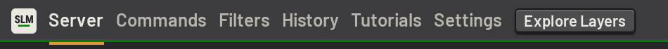
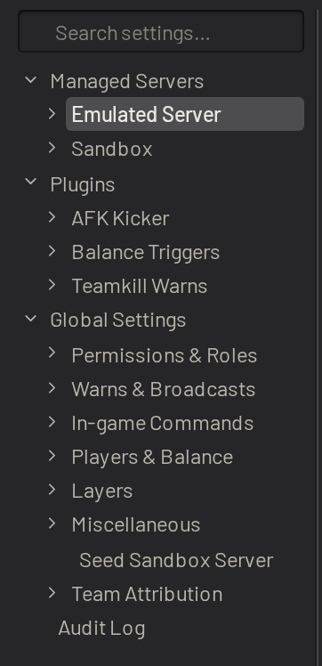

# Configuring SLM

This guide assumes a running instance of SLM. See [installing.md](../../installing.md) to set one up.

SLM can be configured mostly from the settings page. Most settings can keep their defaults, but a few must be set before
SLM can run your server.

Open the settings page from the header:

Use the table of contents on the left to move between sections:

Each setting has a _GUI_ / _YAML_ toggle, so it can also be edited as YAML. Settings that most installs never change are
kept in a collapsed _Advanced_ disclosure at the bottom of their section. The table of contents still lists them, and
navigating to one opens the disclosure that holds it.

Any setting or section can carry a comment, for the next person to read why it is set the way it is. Hover the
setting's name and click the comment icon beside the link icon. In YAML mode a comment is an ordinary `#` line
directly above the setting, and a comment written in either mode shows up in the other. Comments are saved together
with your other changes.

## First steps

Set these up first, in this order:

1. [Permissions and users](permissions.md), so the right people can sign in and act.
2. [Servers](servers.md), to connect SLM to your squad server.
3. [Layer pool and filters](layer_pool.md), to decide which layers your server plays.

The other pages in this section cover the remaining settings by topic.

## Nav links

The _Links_ menu in the nav bar holds links for your users, such as your community's rules or a Discord invite. A
fresh install starts with links to SLM on GitHub and to these docs.

- Links for every server are under _Miscellaneous > Nav Links_ in the settings.
- A server can add its own in its server settings. They show below the global ones while that server is selected.

Each link is a label and a url.
