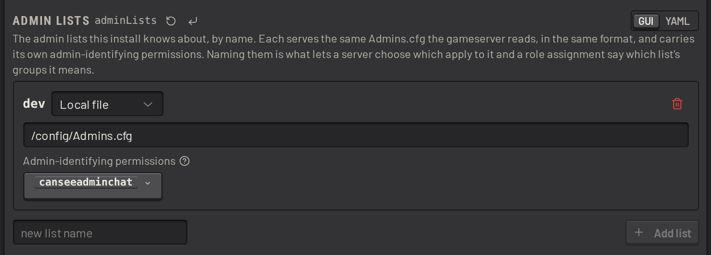
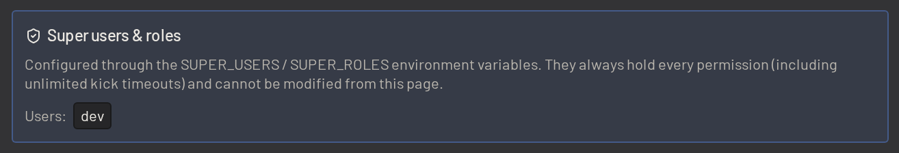
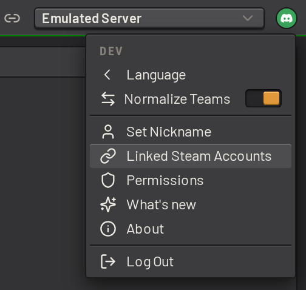
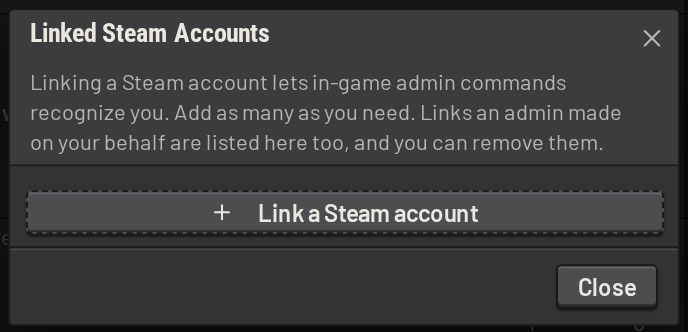
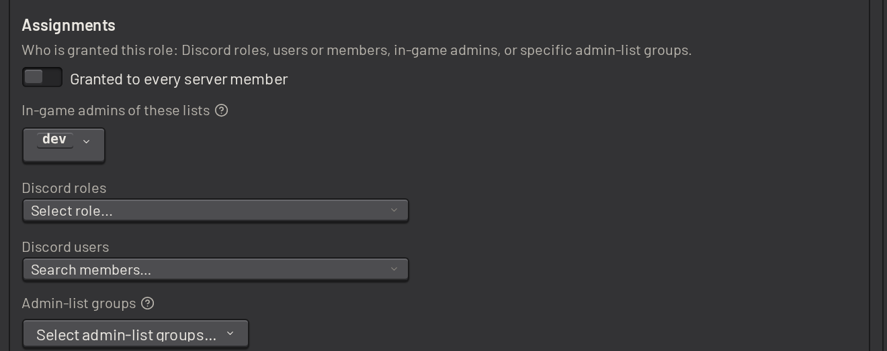
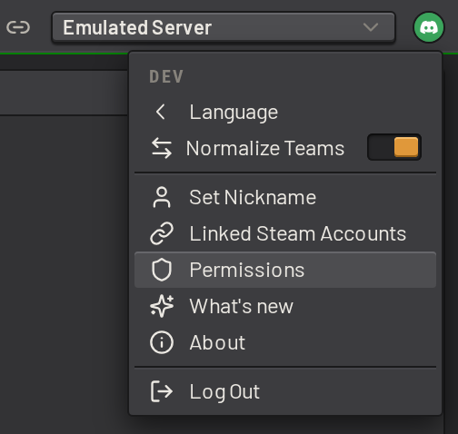
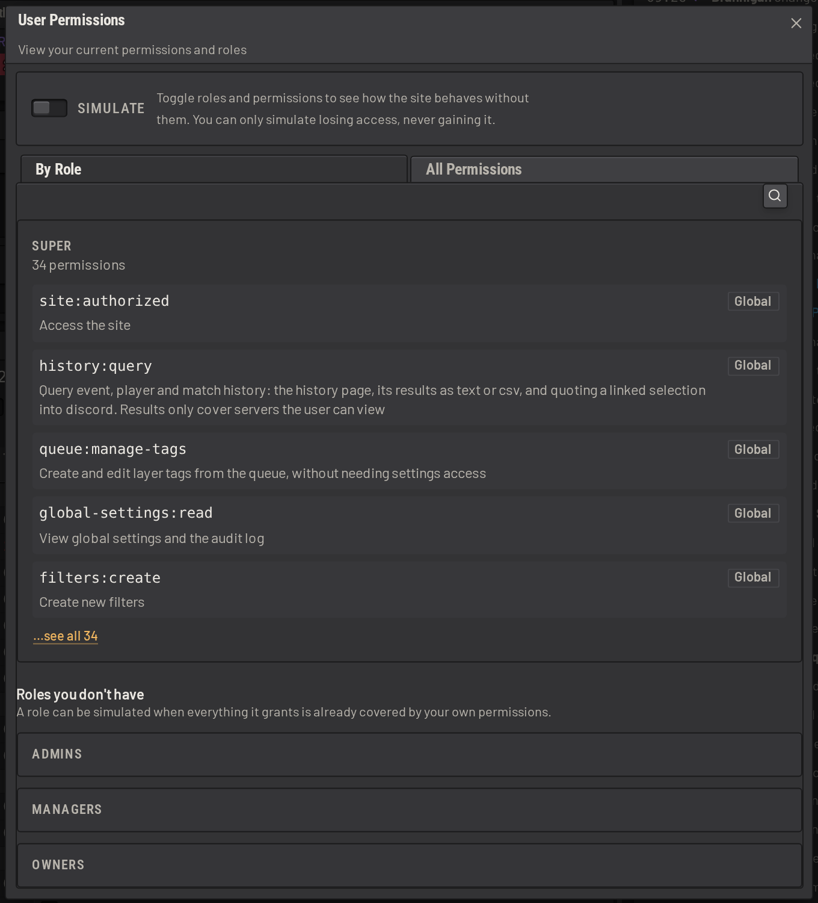
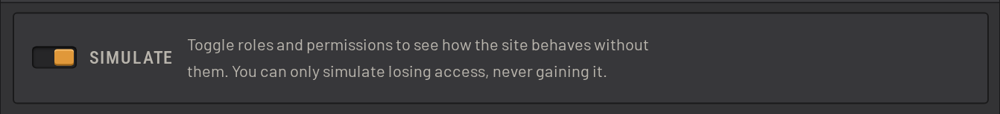

# Permissions and users

Access to SLM is managed through roles (role-based access control, or RBAC). A _role_ lists _permissions_, and either
allows or denies each one for everyone assigned that role. A denial withholds the permission even from someone another
role allows it to. Some permissions are global. Many can be scoped to one squad server.

Unlike discord roles, SLM roles are not hierarchical: no role outranks another. Someone holds every permission any of
their roles allows, minus every permission any of their roles denies.

## Admin lists

The admin list settings are under _Permissions & Roles_.

An _admin list_ is the standard `Admins.cfg` format, which SLM reads as-is. Point it at a file mounted into the
container, or at a copy hosted over SFTP or HTTP(S).

By default, SLM treats a player with the `canseeadminchat` role as an admin. If your list uses a different role,
change this setting:

An admin list identifies a player by steam ID or EOS ID, and one list can use a mix of the two.

More than one admin list can be configured, which is useful when each of your servers has its own. Each server names
the lists that apply to it. See [Server admin lists](servers.md#server-admin-lists).

The groups in your admin list do more than mark who is an admin. They can also be used to:

- assign [SLM roles](#assigning-roles) to the members of a group
- [colour players by group](players.md#player-grouping-modes) in the players panel and the activity charts

Add the first real admin list to the `admins` role as well. The default assignment names only the sandbox's own list, so
a new list grants nobody the `admins` role until it is named there. See [Assigning roles](#assigning-roles).

## Super users

A fresh install has no role assignments of its own, so the `SUPER_USERS` and `SUPER_ROLES` that are set in `.env` are
the bootstrap. They hold every permission unconditionally, including unlimited kick timeouts, and cannot be changed from
the settings page:

Keep at least one after real roles are assigned, so someone can still sign in if an assignment goes wrong.

## Default roles

Go to the _Permissions & Roles_ section of the global settings. Three roles exist by default:

- `admins`: the features needed for day-to-day operations: the queue, votes, filters, and managing, warning,
  broadcasting to and kicking players. Maximum timeout of 2h. It is assigned to the in-game admins of the sandbox's own
  admin list, so the in-game commands work before anyone configures RBAC. Point it at your real lists as they are added.
- `managers`: everything `admins` can do, plus policing other people's queue notes, enabling and disabling servers,
  and restarting SLM. It can edit every global setting except the permissions config, and every server setting
  except the connection details. Maximum timeout of 6h. It cannot add a server, because adding one means supplying
  connection details.
- `owners`: every permission. Maximum timeout of 52w. It is assigned to nobody by default.

All three cover a new server without changes. Their permissions are granted unscoped, and the `managers` settings grant
names no servers, which means every server. When a server is added, revisit only the roles that narrow a permission or a
settings grant to named servers.

## Assigning permissions to roles

The _Permissions_ table holds everything a role may do. Each row is one permission, with three columns:

| Column       | What it holds                                                                                     |
| ------------ | ------------------------------------------------------------------------------------------------- |
| _Effect_     | Allow or Deny. A denial overrides an allow, so use it to carve an exception out of a wider grant. |
| _Permission_ | The permission itself, or `*` for all of them.                                                    |
| _Scope_      | What narrows the permission. Leave it empty to grant the permission unrestricted.                 |

A scope names specific servers, specific setting paths, or a cap such as a maximum timeout.

Settings access works the same way:

- `global-settings:write` takes dotted setting paths, such as `vote.voteDuration`, or `vote` for the whole section.
  Leave the scope empty and the role can edit every global setting. Either way it implies `global-settings:read`.
- `server-settings:write` is the same for a server's settings, and its scope can also name specific servers. It
  never reaches the connection details.
- `server-settings:write-sensitive` is a separate permission. It is the only way to view or edit a server's RCON and
  SFTP connection details.

## Assigning roles

A role can be assigned to a user or to a player:

- a _user_ signs in with their discord account and works from the web interface
- a _player_ is in the game and uses the [in-game commands](admin_actions.md#in-game-commands)

A user can link their discord account to their in-game account, and the permissions from both then combine for
every action:

This is optional, and matters mostly for people who hold elevated permissions on their user account
and want to use them in game.

The _Assignments_ subsection of a role holds five sources. Two of them cover in-game players:

- _In-game admins of these lists_: the role goes to every player an admin list counts as an admin. It applies
  only on servers that use that list.
- _Admin-list groups_: the role goes to the members of a named group in a named list, whether or not that group
  identifies admins. A whitelist reserve-slot group works here. Again, it applies only on servers that use the list.

The other three cover users, and take an individual discord user, a discord role, or every member of your discord
server:

## Testing assigned permissions

Every user can see the permissions they hold, in the permissions info dialog:

The dialog groups permissions by role or by permission, and traces each one back to the role that granted it.

Click _Simulate Permissions_ to check and uncheck roles, and see how the interface behaves for someone who holds
them:

The simulation runs in your browser only. The server still checks your real permissions on any action the interface does
not gate.
