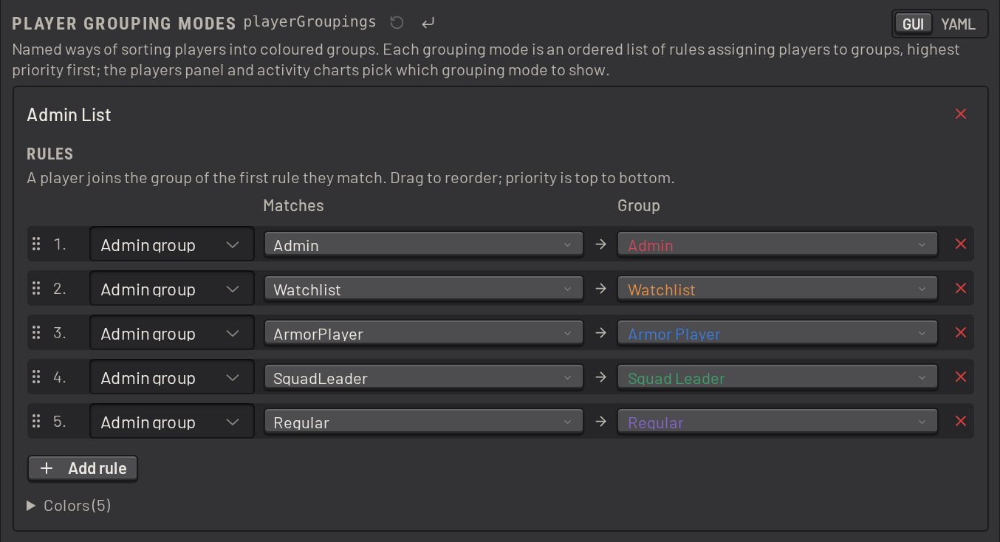
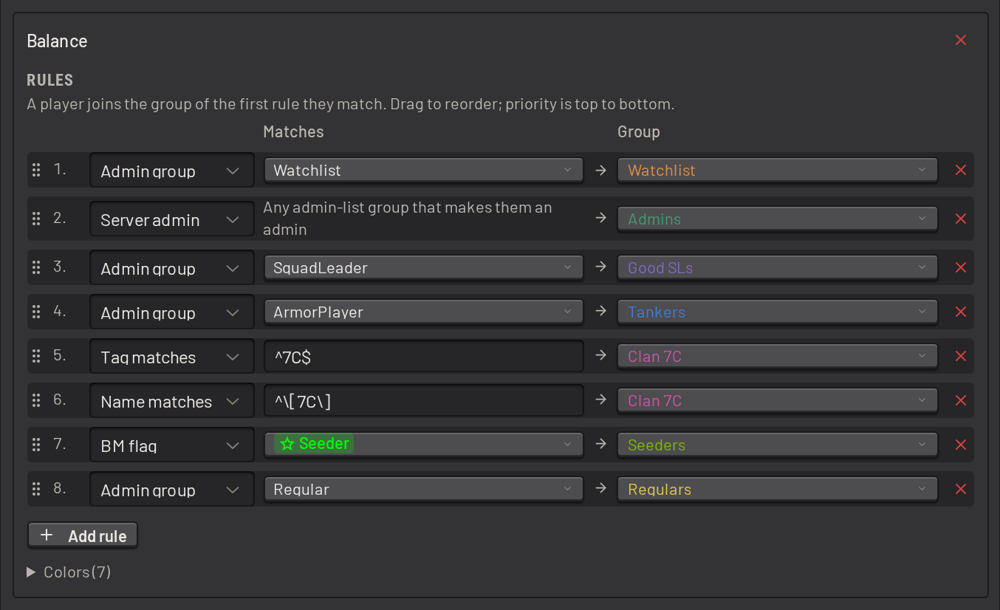
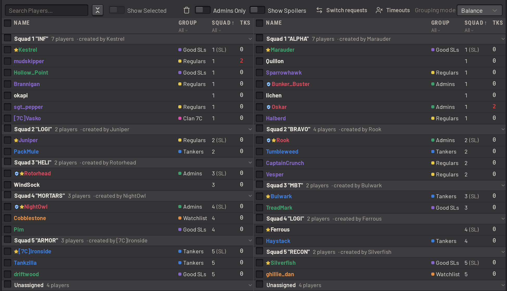
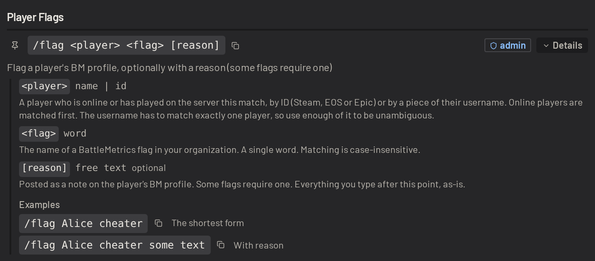
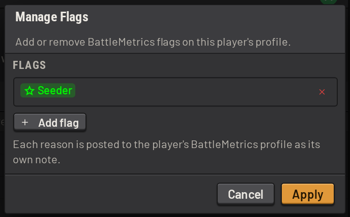
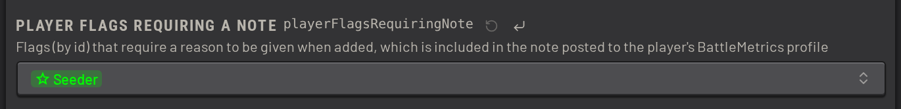
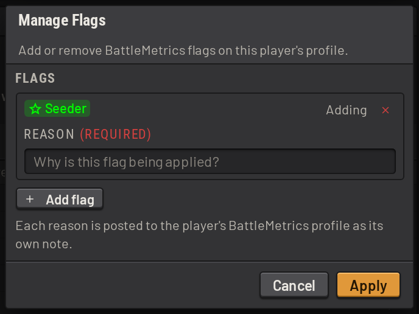
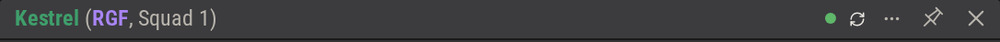

# Players

These settings control how SLM sorts players into groups, and how admins flag players in BattleMetrics.

## Player grouping modes

A _grouping mode_ sorts players into named, coloured groups, for administration and for monitoring balance.
Configure them under _Players & Balance_.

A grouping mode is an ordered list of rules, and a player joins the group of the first rule they match.

A rule can match on:

- a battlemetrics player flag
- an [admin list group](permissions.md#admin-lists)
- a regex on the player's username, which includes any tags they have configured
- a discord role, if the player's steam account is linked to their discord account

Here is a grouping mode keyed on admin list groups:

And here is TacTrig's grouping mode for monitoring balance:

> [!NOTE]
> Maintaining discord to steam account links is a manual process today. A REST api that lets external tools manage
> the links is planned.

SLM then colour-codes the usernames of grouped players wherever they appear:

Choose which grouping mode to show in the players panel and the _Charts_ panel. The _Breakdown_ chart breaks the population
down by the chosen mode:

## Player flagging

Flagging needs the battlemetrics integration (see [installing.md, Integrations](../../installing.md#11-integrations)).

A battlemetrics flag can be applied to a player from in game with the `/flag` command, or from the SLM interface:

A user can add a reason for the flag, which SLM posts as a note on the player's battlemetrics profile. The note is
freeform text for now, and is not connected to the [admin action reasons](admin_actions.md#warns-broadcasts-and-admin-actions).
This may change.

To require a note for a particular flag, name it in _Player Flags Requiring Note_:

A flag set from the battlemetrics interface can take a while to appear in SLM, which caches battlemetrics data
aggressively to stay inside their rate limits. To see a change immediately, purge the cache for that player with the
_refresh_ button:

SLM refreshes a player's flags automatically when it changes them itself.

### Player notes

A note is free text on a player's battlemetrics profile. SLM signs each note it posts with the name of the user who
wrote it. Adding a note needs the `battlemetrics:write-notes` permission.

To add a note:

- in game, use the `/note <player> <text>` command
- in the player details window, click the notebook button beside the flags
- right-click a player, a squad or a selection, and pick _Add Note..._

To read a player's notes, click _Load notes_ in the player details window. SLM fetches a player's notes only when
asked, since each fetch counts against your organization's battlemetrics rate limit. SLM shows a note only when it is shared with
your organization, has no clearance level and has not expired.
