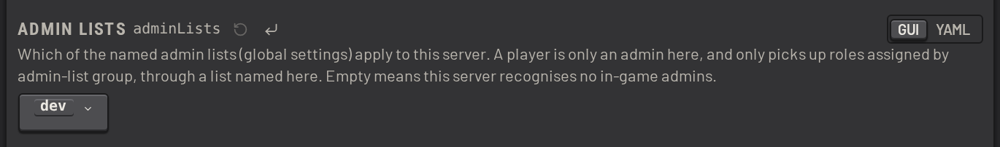

# Servers

One SLM instance can manage several squad servers.

A fresh install already has a server named _Sandbox_. It attaches to an emulated squad server, which imitates a real
one closely enough for SLM to work against. Use it to test things out. See
[sandbox_servers.md](../operations/sandbox_servers.md).

Click _Add Server_ to set up a real one:

## Connecting the server

Each server uses one of three connection modes:

- _local_: SLM shares the machine with the squad server, reading `SquadGame.log` from disk and dialling RCON
  directly. Lowest latency for SLM's event processing. Needs a log file path and RCON details.
- _sftp_: SLM runs elsewhere, tailing the log file over SFTP and dialling RCON over the network. Use this with
  PSG-hosted squad servers, where no program can be run on the game host. Needs SFTP and RCON details.
- _server agent_ (recommended): a small program on the game host streams the log to SLM and proxies RCON. SLM never
  holds the RCON password, and never has to reach the RCON port. Needs only a shared token. See
  [server_agent.md](../operations/server_agent.md).

If a server does not behave as expected, open the [server console](../operations/server_console.md). It shows the RCON traffic and the
log lines as SLM receives them, which shows whether the connection or SLM is at fault.

## Server admin lists

Name which of your [configured admin lists](permissions.md#admin-lists) apply to this server:

A player counts as an admin on this server, and picks up roles from an admin list group, only through a list named here.
If none is named, SLM recognises no in-game admins on this server.

## Installed mods

SLM's catalog covers vanilla Squad and several mods. Name the ones this server actually has installed, under
_Installed Mods_ in its settings. A new server starts with OWI alone, which is vanilla Squad.

A layer from a collection not named here cannot load on this server, so SLM will not queue it, will not generate
one, and will not offer one as a vote choice. Such a layer stays visible in the layer table, greyed out with the
reason, and a queue item on one is flagged in the queue and in the in-game next-layer warning.
