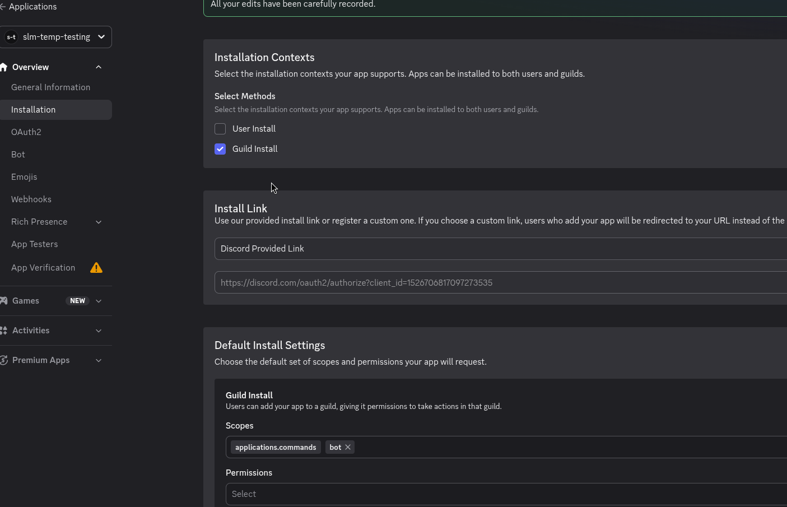
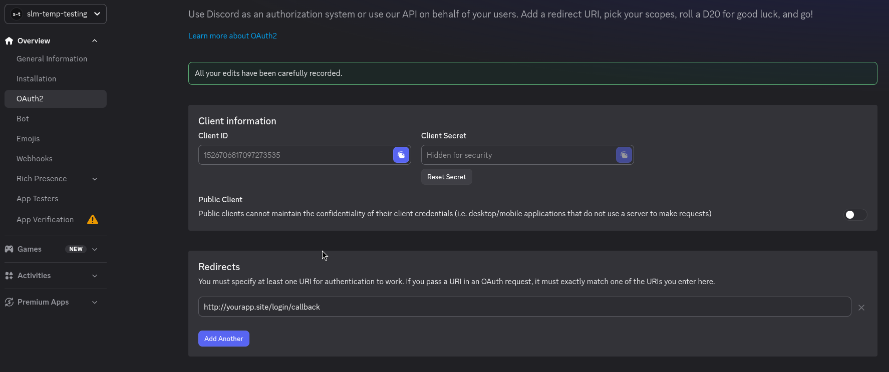
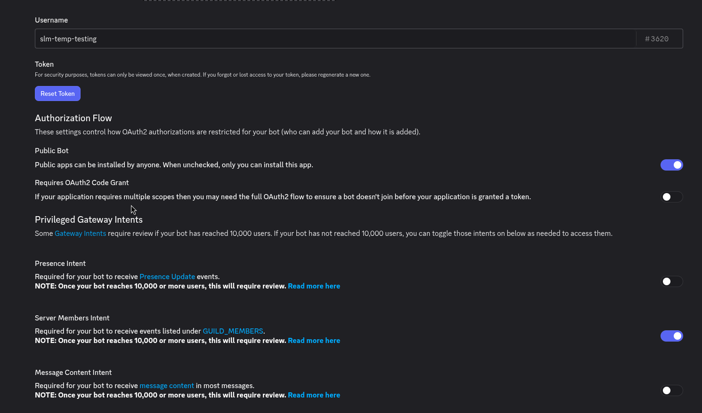

# Installing SLM

### 1. Prerequisites

1. Docker, and a server to run it on: [installation instructions](https://docs.docker.com/get-docker/)
2. A domain, and some way to send traffic to SLM.
3. A Discord server you have permission to install apps on.

### 2. Where to install

SLM needs access to your squad server's log files. There are three ways to give it that: mount the log files
directly into the container, connect over SFTP (this works with PSG-hosted servers), or run a server agent on the
game host that streams the log data and proxies RCON (see
[configuring.md#server-agent](configuring.md#server-agent)). SLM can manage any number of squad servers, so factor
that in when deciding where to install it.

### 3. Installation

#### 3.1. Docker Compose

```sh
mkdir squad-layer-manager && cd squad-layer-manager
curl -fsSL https://raw.githubusercontent.com/Tactrigsds/squad-layer-manager/main/install.sh | bash
```

This lays down the files a deployment is made of:

- `docker-compose.yaml`
- `.env`, copied from `.env.example`, which is left alongside it
- `.env.secrets`, copied from `.env.secrets.example`, holding every credential SLM reads (see [3.3](#33-secrets))
- the `edit-global-settings.sh` and `restore.sh` helpers
- an `observability/` directory of Grafana and OpenTelemetry collector config

It also creates `data/`, which holds the database file and any other persistent data, and is bind-mounted into the
app container.

#### 3.2. Discord app

SLM authenticates users through a discord app you own, installed on your org's discord server.

Create one at [discord.com/developers/applications](https://discord.com/developers/applications).

Then make the settings match these screenshots:


Note the `applications.commands` and `bot` scopes. Both are needed.

Register `<ORIGIN>/login/callback` as a redirect uri, where ORIGIN is wherever you plan to serve SLM from.


Set ORIGIN in `.env` to match (without `/login/callback`), and fill out `DISCORD_CLIENT_ID` in `.env`.
`DISCORD_CLIENT_SECRET` is a credential, so it goes in `.env.secrets` instead (see [3.3](#33-secrets)).

Configure the bot's intents like this:


Copy your bot token into `DISCORD_BOT_TOKEN` in `.env.secrets`.

Like most discord apps, SLM must be configured with a public install link. This is not a security issue. Another
server getting hold of the install link cannot perform any actions, and SLM automatically leaves any discord server
that is not the one configured below.

Set `DISCORD_HOME_GUILD_ID` to the id of your org's discord server. To find it, enable Developer Mode in your
discord settings and right-click the server icon. Only members of that server can be granted access to SLM.

Set at least one `SUPER_USERS` id to your discord user id (click your profile picture with developer mode enabled),
or nobody can administer the app. Super users hold every permission unconditionally, and are the bootstrap you
cannot lock yourself out of. This person must be a member of your org's discord server.

Next, install the app on your org's discord server by visiting the install link on the `Installation` page. Make
sure it is the same server as `DISCORD_HOME_GUILD_ID` in `.env`.

#### 3.3. Secrets

Every credential SLM reads lives in `.env.secrets`. The rest of the configuration stays in `.env`.

| variable                             | what it is                                                          |
| ------------------------------------ | ------------------------------------------------------------------- |
| `SETTINGS_ENCRYPTION_KEY`            | encrypts sensitive settings at rest (see [3.4](#34-encryption-key)) |
| `DISCORD_CLIENT_SECRET`              | the discord app's oauth2 client secret                              |
| `DISCORD_BOT_TOKEN`                  | the discord bot token                                               |
| `BM_PAT`                             | the battlemetrics personal access token                             |
| `BACKUP_SFTP_PASSWORD`               | if backups upload to an sftp host                                   |
| `BACKUP_SFTP_PRIVATE_KEY_PASSPHRASE` | if that host authenticates with an encrypted key                    |

`install.sh` writes this file for you from `.env.secrets.example`, `chmod 600`, with a freshly generated
`SETTINGS_ENCRYPTION_KEY` already in it. Fill in the rest as you work through the sections below. Keep it out of
version control, and out of any backup you would not also put a password in.

**Mount this file into the container. Do not pass these as environment variables.** The `docker-compose.yaml` you
installed already does:

```yaml
services:
   app:
      volumes:
         - ./.env.secrets:/app/.env.secrets:ro
      env_file: .env
```

SLM reads `.env.secrets` as a file and never loads it into its own environment, so the credentials stay out of
`docker inspect`, `/proc/<pid>/environ`, and the environment every subprocess inherits. Everything else stays in
`.env`, handed over with `env_file`.

If your secrets come from a secrets manager, mount whatever file it produces and point `SECRETS_FILE` at it. As a
docker secret, for instance:

```yaml
services:
   app:
      environment:
         - SECRETS_FILE=/run/secrets/slm-secrets
      secrets:
         - slm-secrets

secrets:
   slm-secrets:
      file: ./.env.secrets
```

The format is the same wherever it is mounted: `KEY=value`, one per line. A `SECRETS_FILE` pointing at something
that is not there stops the boot, rather than quietly coming up without your credentials.

#### 3.4. Encryption key

SLM encrypts sensitive settings at rest: each server's RCON and SFTP passwords, and its server-agent token. This is
keyed by `SETTINGS_ENCRYPTION_KEY`, which is required, and the app refuses to start without it. `install.sh`
generates one into `.env.secrets` for you. If it could not, or you installed by hand, generate a strong key and
paste it in yourself:

```sh
openssl rand -base64 32
```

Keep this key safe and stable. If you change or lose it, the already-encrypted connection secrets can no longer be
decrypted and have to be re-entered on the settings page. The first boot after setting the key transparently
encrypts any connection secrets previously stored in plaintext.

#### 3.5. Battlemetrics

SLM has a battlemetrics integration. Among other things, it lets users update player flags remotely and gives more
context when managing players on the servers.

Set `BM_PAT` (in `.env.secrets`, it is a credential) to a battlemetrics personal access token, and `BM_ORG_ID` (in
`.env`) to your org's battlemetrics id. The required scopes are listed in the description of the `BM_PAT`
environment variable.

The integration is optional. Leave `BM_PAT` unset and it turns itself off: nothing is polled, no player flags or
profiles are read, and the parts of the app that show them are hidden rather than failing. Set `BM_ENABLED=false` to
turn it off while keeping the token configured.

#### 3.6. Backups

Backups happen for two reasons. One of them is not optional.

**Before every migration**, the database is snapshotted into `BACKUPS_DIR` first. This happens whether the app
applies migrations itself at boot (`DB_AUTOMIGRATE`, the default) or you run `pnpm db:migrate:prod` yourself, and it
is what you restore from if an upgrade turns out to have been a mistake. Nothing is applied if the snapshot fails.
The most recent pre-migration backup is never deleted by retention, however old it gets: it is the only way back
from the migration it was taken before.

A migration will not run against a database another process has open. Stop SLM before migrating manually.

**Periodic backups** are off by default. Set `AUTOMATIC_BACKUPS_PERIODIC` to a duration (e.g. `72h`) and the app
snapshots its database on that interval.

The two share a schedule and a retention window rather than running as separate systems. A backup taken to migrate
counts as that interval's backup, and is uploaded and recorded like any other, so an upgrade does not produce two
copies of the same database a minute apart, and the next periodic one is a full interval later.

Every backup is named for where it came from:

```
slm-backup-<db>[-pre-migration]-<sha>-<yyyyMMdd>-<HHmmss>.sqlite3.gz

slm-backup-db-a6047f44deb0-20260713-134504.sqlite3.gz                 a periodic backup
slm-backup-db-pre-migration-9c1f0a2b3d4e-20260713-134016.sqlite3.gz   taken before a migration
```

`<db>` is the source database's filename without its extension, and retention only deletes names matching it, so two
instances sharing a directory cannot prune each other's backups. `<sha>` is the short git sha of the build that
owned the database when the snapshot was taken, recorded inside it in `_slm_meta`, or `unknown` if the database
carried no stamp. For a pre-migration backup that is the version being upgraded _from_, which is the one a rollback
wants. The timestamp sorts chronologically.

Each run is also recorded in the audit log as a `BACKUP_CREATED` event.

Backups can also be uploaded to an SFTP destination. See below.

| variable                             | default          | what it does                                                          |
| ------------------------------------ | ---------------- | --------------------------------------------------------------------- |
| `AUTOMATIC_BACKUPS_PERIODIC`         | unset (disabled) | how often to back up, e.g. `72h`                                      |
| `EVENT_HISTORY_RETENTION_PERIOD`     | unset (disabled) | prune server events older than this, e.g. `90d` (see below)           |
| `BACKUPS_DIR`                        | `./data/backups` | where backups are written                                             |
| `BACKUPS_RETAIN_COUNT`               | `10`             | how many backups to keep, locally and remotely. `0` keeps all of them |
| `BACKUP_SFTP_HOST`                   | unset (disabled) | setting this uploads each backup to that host                         |
| `BACKUP_SFTP_PORT`                   | `22`             |                                                                       |
| `BACKUP_SFTP_USERNAME`               |                  | required when a host is set                                           |
| `BACKUP_SFTP_PASSWORD`               |                  | this or a private key is required when a host is set                  |
| `BACKUP_SFTP_PRIVATE_KEY_PATH`       |                  | path to a private key, as an alternative to a password                |
| `BACKUP_SFTP_PRIVATE_KEY_PASSPHRASE` |                  | if the key needs one                                                  |
| `BACKUP_SFTP_DIR`                    | `.`              | remote directory, created if missing                                  |

Two SLM instances must not share a `BACKUP_SFTP_DIR` unless their databases are named differently. Retention deletes
any backup matching its own name, so they would prune each other's.

A failed upload does not fail the backup. The local copy is still written, and the audit event records that it never
left the box.

##### Restoring

`restore.sh` stops the app, puts a backup back, and starts it again:

```sh
./restore.sh --list                   # what backups there are, and the build each belongs to
./restore.sh --inspect --latest       # which build a backup belongs to, without restoring it
./restore.sh --pre-migration          # the snapshot taken before the last migration: undo a bad upgrade
./restore.sh --latest                 # the newest backup of any kind
./restore.sh --commit-sha commit-a6047f4    # the newest backup taken by a given build
./restore.sh --from slm-backup-db-a6047f44deb0-20260713-134504.sqlite3.gz    # a specific one
```

`--from` also takes a path, which is how you restore a backup fetched back off the SFTP target. Drop it in
`data/backups` or pass the full path.

Because the filename carries the owning build's sha, `--list` shows the build, and `--commit-sha` can pick the
newest backup from a particular version without unpacking anything. `--commit-sha` accepts a full sha, a short one,
or a `commit-<sha>` image tag, and pairs with `--pre-migration` to restrict the search to pre-migration snapshots.

`--inspect` pairs with a backup selector (`--latest`, `--pre-migration`, `--from`) and changes nothing. It unpacks
the backup and reports which app build the database belongs to, which image tag to pin, and how far behind the
current build it is. Run it first when rolling back an upgrade, so you know which version to point
`docker-compose.yaml` at before you start the app.

The database being replaced is kept, renamed to `db.sqlite3.replaced-<timestamp>` next to it, because a restore is
otherwise the one operation with no undo. Delete it once you are happy. The restore is checked (`integrity_check`)
before anything is moved, so a corrupt archive costs nothing.

Prefer this over doing it by hand. `gunzip -c backup.gz > data/db.sqlite3` looks complete and is not: the old `-wal`
file is still sitting there, SQLite replays it over the file you just restored, and you silently get the **old**
database back, with `integrity_check` calling it fine. Restoring while the app is running is worse, because the app
goes on writing to a database that is no longer at that path, and those writes are lost.

If you are rolling back a bad upgrade, roll the image back too. Restoring a pre-migration backup and then starting
the same version just applies the same migration again, and the restore says so if the database it put back is
behind the build. Each database is stamped with the git sha and branch of the app that last ran against it, so the
restore (and `--inspect`) names the exact image tag to pin. For a pre-migration snapshot that is the version you
were upgrading from, which is the one to roll back to.

#### 3.7. Event history retention

`EVENT_HISTORY_RETENTION_PERIOD` prunes old server events (chat, kills, connects) as part of each backup run, which
is what keeps the database from growing without bound. Events are deleted for matches older than the retention
period, except that the 100 most recent matches per server are always kept regardless of age, because the app loads
them at startup. Match records themselves are never deleted, only their events, and neither is the audit log. The
prune runs before the snapshot, so a backup never carries rows that were just dropped.

The first prune after turning this on clears the whole accumulated backlog, and is much larger than the ones that
follow.

#### 3.8. Telemetry

Detailed logs and telemetry are available via grafana at `http://localhost:3001`, which you may also want to expose
to the internet. Change the default admin password before doing so. Three dashboards come preconfigured for
monitoring SLM. Behind them, an OpenTelemetry collector routes metrics, logs and traces into one
[VictoriaMetrics](https://victoriametrics.com/) store per signal. See
[observability/README.md](../observability/README.md) for how the pieces fit together and what the retention windows
are.

If you do not want any telemetry, set `OTEL_ENABLED=false` and comment out or delete the `victoria-metrics`,
`victoria-logs`, `victoria-traces`, `otel-collector` and `grafana` services from `docker-compose.yaml` before
starting the app.

#### 3.9. Starting SLM

With docker installed and running, and a public url for the server, start it up:

```sh
docker compose up -d
```

If docker is configured to start on boot, the app starts automatically after a reboot.

Stop everything with `docker compose down`. To stop just the app and leave grafana running, use `docker compose stop
app`.

Once the app is running you can sign in with discord OAuth, and move on to [configuring SLM](configuring.md).

#### 3.10. Upgrading

```sh
docker compose pull && docker compose up -d
```

Migrations are applied on boot by default. Set `DB_AUTOMIGRATE=0` to disable that. Either way the database is backed
up first (see [3.6](#36-backups)), so a bad upgrade is recoverable.

An install that predates `.env.secrets` keeps working untouched, since SLM reads the credentials from wherever it
finds them. To move them out of the environment (see [3.3](#33-secrets)), take the six variables in that section out
of your `.env`, put them in a `.env.secrets` next to it, then add the mount to the `app` service in your
`docker-compose.yaml` before `docker compose up -d`:

```yaml
volumes:
   - ./.env.secrets:/app/.env.secrets:ro
```

Run migrations manually with `docker compose run --rm app pnpm db:migrate:prod`.
