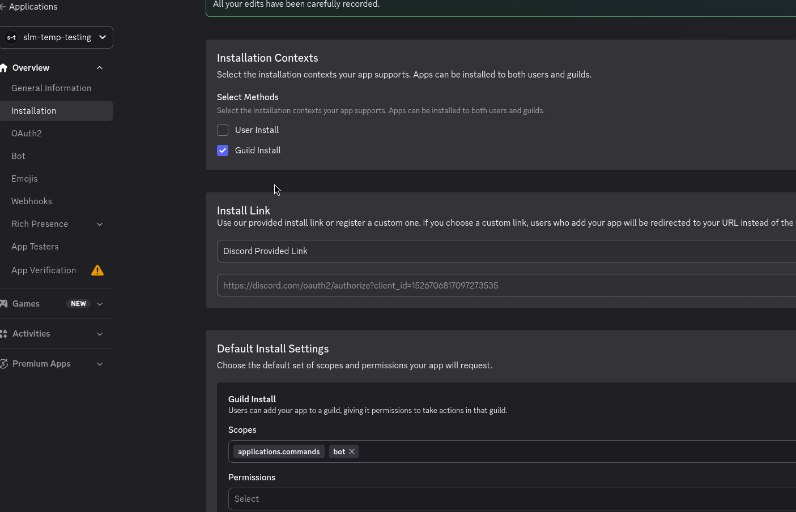
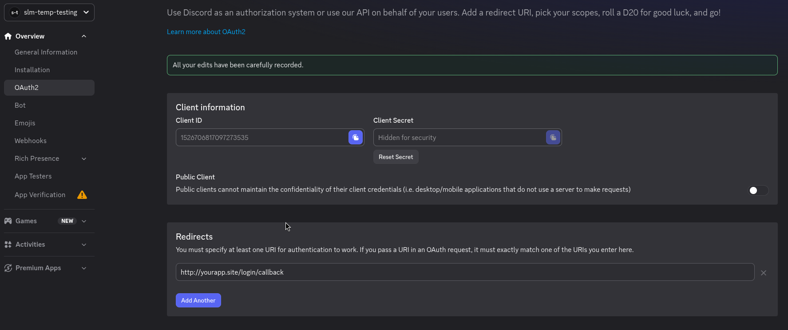
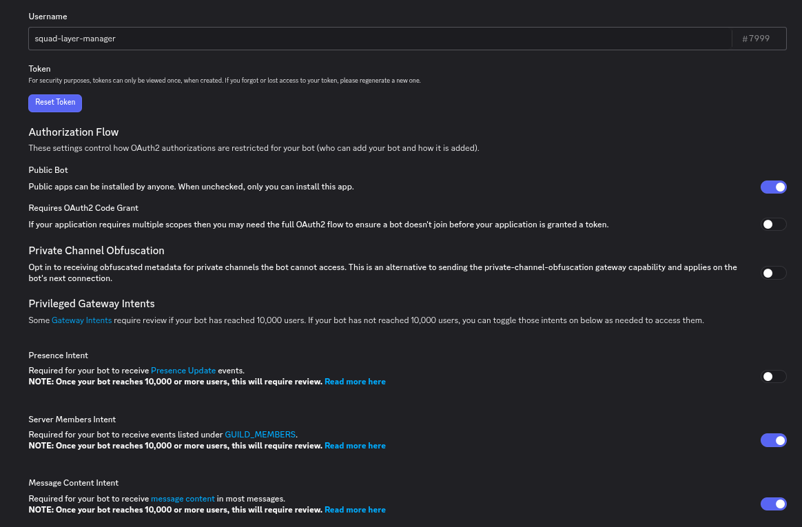

# Installing SLM

## Trying it out first

To see SLM before installing it for real, run a demo instance:

```sh
docker run --rm -p 127.0.0.1:3000:3000 -e DEMO=1 ghcr.io/tactrigsds/squad-layer-manager:latest
```

Open http://localhost:3000 and sign in with any username from the form on the front page. The demo starts with example
data and needs no Discord server. Everything in it is thrown away when the container stops. The demo encrypts its
settings with a key published in this repository, so enter no real credential into it.

Anyone who can open the demo signs in as an admin. The demo started by the command above accepts connections from this
machine only.
Do not publish the port to a network you do not control.

## Installation Procedure

### 1. Prerequisites

1. Docker, and a server to run it on: [installation instructions](https://docs.docker.com/get-docker/)
2. A Discord server on which your account can install apps.
3. A domain, and a way to serve SLM over HTTPS. Two options are recommended:
   - [Caddy](https://caddyserver.com/), the simplest. It gets and renews HTTPS certificates from Let's Encrypt by
     itself.
   - [Cloudflare Tunnel](https://developers.cloudflare.com/tunnel/), which is more managed, and does not need a port
     exposed on your server.

   Optionally, set up a second subdomain for the included Grafana instance (see [Telemetry](#9-telemetry)).

### 2. Where to install

SLM needs access to your squad server's log files, and an RCON connection. There are three ways to achieve this:

- Install SLM where it's possible to mount the log files into the container, and access RCON over a VLAN or the local
  network. This gives the lowest latency, and is relatively secure. It often costs some control over where SLM runs,
  depending on your org's game server host.
- Access the log files over SFTP, and access RCON remotely through an exposed port. Logs arrive with higher latency,
  and remote RCON access is insecure, because RCON is not encrypted.
- **Recommended:** run the SLM server agent on the game host. It streams log data and proxies RCON over a secure
  websocket connection. Your squad server or hosting provider does not need to expose an additional port, and how and
  where SLM is hosted stays under your control. See [server_agent.md](guide/operations/server_agent.md).

### 3. Docker Compose

```sh
mkdir squad-layer-manager && cd squad-layer-manager
curl -fsSL https://raw.githubusercontent.com/Tactrigsds/squad-layer-manager/main/install.sh | bash
```

This installs the newest release. To pick something else, pass a flag after `bash -s --`:

```sh
curl -fsSL https://raw.githubusercontent.com/Tactrigsds/squad-layer-manager/main/install.sh | bash -s -- --channel latest
```

| flag               | installs                                                                    |
| ------------------ | --------------------------------------------------------------------------- |
| `--channel stable` | the newest release, and each later release on upgrade. This is the default. |
| `--channel latest` | every change as soon as it passes tests                                     |
| `--version <v>`    | one release, e.g. `--version 2026.9.4`, and stays on it                     |

To install into another directory, add it last: `bash -s -- --channel latest /opt/slm`. The choice is saved as
`SLM_IMAGE_TAG` in `.env`, and can be changed later (see [Upgrading](#13-upgrading)).

This lays down the files for the deployment:

- `docker-compose.yaml`
- `.env`, copied from `.env.example`, which is left alongside it
- `.env.secrets`, copied from `.env.secrets.example`, holding credentials needed by SLM on startup (see
  [Secrets](#5-secrets))
- the `edit-global-settings.sh` and `restore.sh` helpers
- an `observability/` directory of Grafana and OpenTelemetry collector config

It also creates `data/`, which holds the database file and any other persistent data, and is bind-mounted into the
app container.

### 4. Discord app

SLM authenticates users through your own discord app, installed on your org's discord server.

Create one at [discord.com/developers/applications](https://discord.com/developers/applications).

Then make the settings match these screenshots:


The `applications.commands` and `bot` scopes are both required.

Register `<ORIGIN>/login/callback` as a redirect uri, where ORIGIN is the address SLM will be served from.


Set ORIGIN in `.env` to match (without `/login/callback`), and fill out `DISCORD_CLIENT_ID` in `.env`.
`DISCORD_CLIENT_SECRET` is a credential, so it goes in `.env.secrets` instead (see [Secrets](#5-secrets)).

Configure the bot's intents like this:


Copy your bot token into `DISCORD_BOT_TOKEN` in `.env.secrets`.

Like most discord apps, SLM must be configured with a public install link. This is not a security issue. Another
server getting hold of the install link cannot perform any actions, and SLM automatically leaves any discord server
that is not the one configured below.

Set `DISCORD_HOME_GUILD_ID` to the id of your org's discord server. To find it, enable Developer Mode in your
discord settings and right-click the server icon. Only members of that server can be granted access to SLM.

Set at least one `SUPER_USERS` id to your discord user id (click your profile picture with developer mode enabled), or
nobody can administer the app. Super users hold every permission unconditionally, so they cannot be locked out. This
person must be a member of your org's discord server.

Next, install the app on your org's discord server by visiting the install link on the `Installation` page. Make
sure it is the same server as `DISCORD_HOME_GUILD_ID` in `.env`.

### 5. Secrets

Secrets that SLM needs at startup are in `.env.secrets`, and the rest of the base configuration is in `.env`.

| variable                             | what it is                                                                                         |
| ------------------------------------ | -------------------------------------------------------------------------------------------------- |
| `SETTINGS_ENCRYPTION_KEY`            | encrypts sensitive settings at rest (see [Encryption key](#7-encryption-key))                      |
| `SETTINGS_ENCRYPTION_KEY_PREVIOUS`   | the key being rotated away from, set only while rotating (see [Encryption key](#7-encryption-key)) |
| `DISCORD_CLIENT_SECRET`              | the discord app's oauth2 client secret                                                             |
| `DISCORD_BOT_TOKEN`                  | the discord bot token                                                                              |
| `BACKUP_SFTP_PASSWORD`               | if backups upload to an sftp host                                                                  |
| `BACKUP_SFTP_PRIVATE_KEY_PASSPHRASE` | if that host authenticates with an encrypted key                                                   |

The BattleMetrics, Squad Browser and Steam credentials are not environment variables. Enter them on the settings
page once SLM is running (see [Integrations](#11-integrations)).

`install.sh` writes this file from `.env.secrets.example`, `chmod 600`, with a freshly generated
`SETTINGS_ENCRYPTION_KEY` already in it. Fill in the rest while working through the sections below. Keep it out of
version control, and out of any backup not secure enough to hold a password.

**Mount this file into the container. Do not pass these as environment variables.** The installed `docker-compose.yaml`
already does:

```yaml
services:
   app:
      volumes:
         - ./.env.secrets:/app/.env.secrets:ro
      env_file: .env
```

SLM reads `.env.secrets` as a file and never loads it into its environment, so the credentials do not show up in
`docker inspect` or in anything SLM starts. `.env` is passed to the container with `env_file`.

### 6. Integration with secrets managers

If a secrets manager delivers your credentials, point SLM at what it mounts. SLM reads two layouts:

- `SECRETS_FILE`: one file in the same `KEY=value` format as `.env.secrets`, wherever it is mounted.
- `SECRETS_DIR`: a directory holding one file per credential, named after the variable. Docker and podman secrets,
  a kubernetes secret volume and systemd's `LoadCredential=` all produce this layout. SLM reads only the variables
  listed under [Secrets](#5-secrets) from it, and drops a trailing newline.

As docker secrets, one per credential:

```yaml
services:
   app:
      environment:
         - SECRETS_DIR=/run/secrets
      secrets:
         - SETTINGS_ENCRYPTION_KEY
         - DISCORD_CLIENT_SECRET
         - DISCORD_BOT_TOKEN

secrets:
   SETTINGS_ENCRYPTION_KEY:
      file: ./secrets/SETTINGS_ENCRYPTION_KEY
   DISCORD_CLIENT_SECRET:
      file: ./secrets/DISCORD_CLIENT_SECRET
   DISCORD_BOT_TOKEN:
      environment: DISCORD_BOT_TOKEN # taken from the environment `docker compose` runs in
```

A file in `SECRETS_DIR` wins over the same variable in `SECRETS_FILE`. If either points at something that does not
exist, SLM refuses to start instead of starting without your credentials.

On one host running Docker Compose, a docker secret sourced from a file is a bind mount of that file. It is kept on
disk in plaintext, exactly as `.env.secrets` is, and neither shows up in `docker inspect`. Pick the layout your
tooling produces. Docker secrets protect the values at rest only under Swarm, or when a secrets manager delivers
them.

### 7. Encryption key

SLM encrypts sensitive settings at rest: each server's RCON and SFTP passwords, its server-agent token, and the
integration tokens entered on the settings page. The key is `SETTINGS_ENCRYPTION_KEY`. It is required, and the app
refuses to start without it. `install.sh` generates one into `.env.secrets`. If it could not, or SLM was installed by
hand, generate one and paste it in:

```sh
openssl rand -base64 32
```

The app refuses a key shorter than 16 characters. Keep the key wherever your backups are kept: a backup restored without
its key comes up with every server disabled and every integration token unset (see
[backups and restoring](guide/operations/backups.md#restoring)).

To rotate the key, move the current value to `SETTINGS_ENCRYPTION_KEY_PREVIOUS`, put the new one in
`SETTINGS_ENCRYPTION_KEY`, and start the app. That boot re-encrypts everything under the new key and logs each
server it did it for. Remove `SETTINGS_ENCRYPTION_KEY_PREVIOUS` afterwards.

If the key is lost, re-enter the RCON and SFTP passwords, agent tokens and integration tokens on the settings page. SLM
disables a server whose secrets it cannot decrypt until they are re-entered.

### 8. Backups

The database is snapshotted into `BACKUPS_DIR` before every migration, whether the app applies them at boot
(`DB_AUTOMIGRATE`, the default) or they are run by hand. Nothing is applied if the snapshot fails. This snapshot is not
optional. It is the restore point after a bad upgrade. Periodic backups are off until an interval is set.

| variable                     | default          | what it does                                                          |
| ---------------------------- | ---------------- | --------------------------------------------------------------------- |
| `AUTOMATIC_BACKUPS_PERIODIC` | unset (disabled) | how often to back up, e.g. `72h`                                      |
| `BACKUPS_DIR`                | `./data/backups` | where backups are written                                             |
| `BACKUPS_RETAIN_COUNT`       | `10`             | how many backups to keep, locally and remotely. `0` keeps all of them |

Backups can also be uploaded to an SFTP destination. See [backups and restoring](guide/operations/backups.md) for that, for the filename
format, and for putting one back with `restore.sh`.

### 9. Telemetry

Detailed logs and telemetry are available via grafana at `http://localhost:3001`. Three dashboards come preconfigured
for monitoring SLM. Grafana accepts connections from the machine SLM runs on only, since its logs and traces record
every player and user SLM sees. Sign in as `admin` with the password `admin`, and Grafana asks for a new password.

To open Grafana from another machine, forward the port over SSH with `ssh -L 3001:localhost:3001 <your server>`
and open `http://localhost:3001` there.

Behind them, an OpenTelemetry collector routes metrics, logs and traces into one
[VictoriaMetrics](https://victoriametrics.com/) store per signal. [observability/README.md](../observability/README.md)
covers how the pieces fit together and the retention windows.

To run without telemetry, set `OTEL_ENABLED=false` and comment out or delete the `victoria-metrics`, `victoria-logs`,
`victoria-traces`, `otel-collector` and `grafana` services from `docker-compose.yaml` before starting the app.

### 10. Starting SLM

With docker installed and running, and a public url for the server, start it up:

```sh
docker compose up -d
```

If docker is configured to start on boot, the app starts automatically after a reboot.

Stop everything with `docker compose down`. To stop only the app and leave grafana running, use `docker compose stop
app`.

Once the app is running, sign in with discord OAuth. Set up the integrations and the discord bot's permissions below,
then move on to [configuring SLM](guide/configuring/overview.md).

### 11. Integrations

SLM authenticates to three outside services: BattleMetrics, Squad Browser and Steam. All three are optional. Their
credentials are not environment variables. Once SLM is running, enter them under _Integrations_ on the settings page.

A saved token is encrypted at rest and not retrievable from the UI.

Editing this section takes a `global-settings:write` grant covering `integrations`. The default managers role cannot
edit it (see [Default roles](guide/configuring/permissions.md#default-roles)).

**BattleMetrics** lets users update player flags from in game and from the dashboard, and shows a player's flags, notes
and profile beside the actions taken against them. Enter a personal access token with these permissions:

- player flags: add and remove. It does not need to create new ones.
- player notes: read and create
- rcon: read

Set _Organization ID_ to your org's battlemetrics id. SLM shows only the flags that belong to it. With no token, SLM
polls nothing and hides the parts of the app that show flags.

**Join button.** Use the join button on the server dashboard to open the server in Squad. SLM looks up the link through
the Squad Browser or through Steam. Configure one of the two for the button to work. Configuring both is not required.

- **Squad Browser** identifies a server by the name the server reports over RCON, and answers whether or not anyone is
  playing on the server. Enter a squad browser api key, which starts with `sqb_`.
- **Steam** builds the link from the lobby of a player in game. Steam answers only while someone is on the server, and
  only for players whose steam profile makes game details public. Enter a web api key from
  https://steamcommunity.com/dev/apikey.

If both are configured, SLM asks the Squad Browser first, and Steam covers the servers the Squad Browser does not list.
With neither, the button is hidden. The button never appears for a sandbox server, which nobody can join.

### 12. Discord bot permissions

The SLM Discord bot replies to a link to a selection on the history page with the selected events as a text file. For
that, switch on `Message Content Intent` on the `Bot` page of your discord app. Without it, the
bot cannot read messages, and the `discord.expandHistoryLinks` setting shows a warning. To turn the replies off, switch
that setting off. The bot only replies to people whose roles grant `history:query`, the permission the history page
itself needs.

The SLM bot only replies in channels where its role has these permissions:

- View Channel
- Send Messages
- Read Message History
- Attach Files

Grant them in one of two ways:

- **Grant the bot a Role:** give the SLM bot a role with these permissions in _Server Settings > Roles_.
- **Specific channels:** leave them off the role, and add them for the SLM bot's role in each channel's _Edit
  Channel > Permissions_. The bot then replies only in those channels.

### 13. Upgrading

```sh
docker compose pull && docker compose up -d
```

`SLM_IMAGE_TAG` in `.env` sets which image tag to follow. To switch, change it and run the commands above.

| `SLM_IMAGE_TAG` | what it points at                                                         |
| --------------- | ------------------------------------------------------------------------- |
| `stable`        | the latest release. Releases group changes and come with release notes.   |
| `latest`        | every change as soon as it passes tests                                   |
| `2026.9.4`      | one release, which never changes. Releases are named `year.month.number`. |

An install without `SLM_IMAGE_TAG` follows `latest`.

Before upgrading, read the notes for every release since yours in [CHANGELOG.md](../CHANGELOG.md), under "For
operators". A "Breaking" note describes a change the operator must make to upgrade. The same notes are logged when the
upgraded app starts, and everyone signed in to SLM can see what changed on its What's new page.

Migrations are applied on boot by default. Set `DB_AUTOMIGRATE=0` to disable that. Either way the database is backed
up first (see [Backups](#8-backups)), so a bad upgrade is recoverable: [backups and restoring](guide/operations/backups.md) covers
putting the snapshot back and pinning the image it belongs to.

An install that predates `.env.secrets` keeps working unchanged, because SLM reads the credentials from wherever it
finds them. To move them out of the environment (see [Secrets](#5-secrets)):

1. Take the variables in that section out of your `.env`.
2. Put them in a `.env.secrets` next to it.
3. Add the mount to the `app` service in your `docker-compose.yaml`, then run `docker compose up -d`:

```yaml
volumes:
   - ./.env.secrets:/app/.env.secrets:ro
```

The BattleMetrics, Squad Browser and Steam credentials moved from the environment to the settings page (see
[Integrations](#11-integrations)). The first boot after upgrading copies `BM_PAT`,
`BM_ORG_ID`, `SQUADBROWSER_API_KEY`, `STEAM_API_KEY` and the matching `*_ENABLED` switches into the settings, and
logs that it did. Remove them from `.env` and `.env.secrets` after that boot: SLM warns on every start while one is
still set, and no longer reads it.

Run migrations manually with `docker compose run --rm app pnpm db:migrate:prod`. Stop the app first: a migration
will not run against a database another process has open.

### 14. Downgrading

SLM can only be upgraded. An upgrade migrates the database, and an older build cannot read a database a newer one has
migrated. An older build refuses to start on such a database, and its log names the build that last ran against it.

The only supported way back is to restore the backup taken before the upgrade, and to pin the build that backup belongs
to. [Rolling back a bad upgrade](guide/operations/backups.md#rolling-back-a-bad-upgrade) walks through both steps.

Switching from `latest` to `stable` is a downgrade too, because `stable` is usually behind `latest`. Instead, pin the
build currently running, then switch to `stable` once a stable release newer than that build is out:

1. Find the running build on SLM's about page, and set `SLM_IMAGE_TAG` to its `commit-<short sha>` tag (see
   [Pinning a version](guide/operations/backups.md#pinning-a-version)).
2. Watch [CHANGELOG.md](../CHANGELOG.md) for the next release.
3. Set `SLM_IMAGE_TAG=stable`, then run the upgrade commands above.
