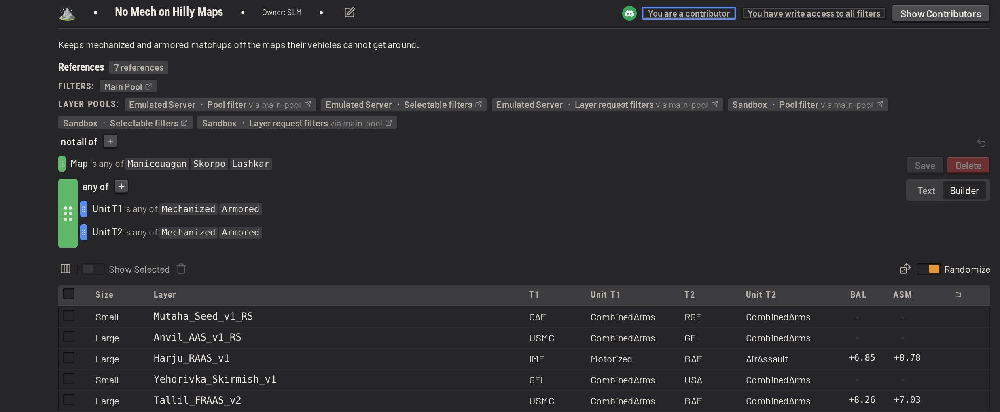
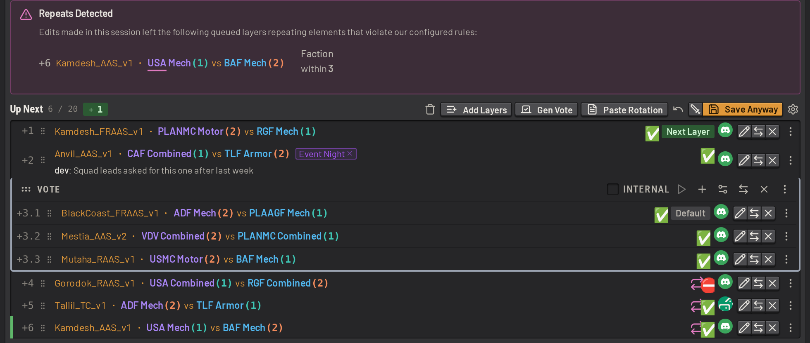
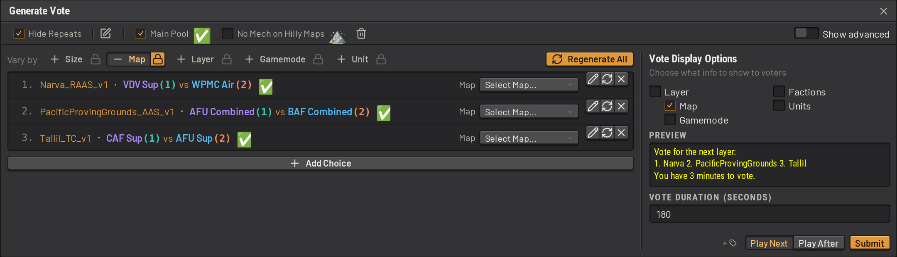
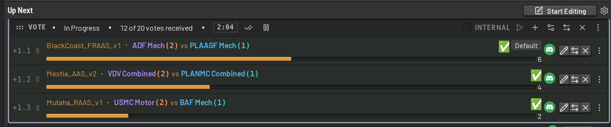

# Layer selection

SLM manages the layer rotation of one or more Squad servers. Admins work from a web app that signs in with Discord, and
from in-game commands. To install SLM, see [installing.md](installing.md).

## The layer queue

The queue holds upcoming layers for the server, as a list of _queue items_. A queue item is either a single layer, or a
[vote](#votes) between several layers. When a queue item reaches the top, SLM sets the queue item's layer as the
server's next layer. For a vote, that layer is the vote's default choice until the vote ends, and the winning choice
after. When the queue runs out, SLM generates a layer from your layer pool, the set of layers your server may play, and
marks the generated layer with a dice icon. [Filters and the layer pool](#filters-and-the-layer-pool) describes the pool
below.

Several admins can edit the queue at once. Click _Start Editing_ to announce an edit to the other admins. The panel
lists the admins online and what each one is editing. Queue items can hold colour-coded tags and freeform notes, for
additional context.

## Filters and the layer pool

The base game offers about 730,000 layers, counting every map, gamemode, faction and unit combination, and this number
can balloon with additional mods. A _filter_ is a named expression that picks a subset of them out. Filters can be
composed by referencing each other to create more complex filters. They can be edited either using a gui or as text via
yaml.

Your created filters can be used to define what layers admins can select by default, what layers SLM can "autogenerate"
when the queue is empty, or just to categorize specific kinds of layers to taste. See
[configuring.md](configuring.md#7-layer-pools-and-filters).

## Repeat rules

A _repeat rule_ defines how soon a map, layer, faction or unit may be played again, counting both the queue and the
recent match history. The defaults catch the same map within 4 matches, the same layer within 7, and the same faction
on the same side within 3. Narrow a rule to named values, such as Skorpo alone over 10 matches.

## Warnings before mistakes are played

SLM checks every layer against your pool, your repeat rules and the mods each server has installed. The layer table
greys out layers a server cannot load, and marks repeats and out-of-pool layers wherever they appear. When an edit
breaks a rule, SLM lists the layers the edit affects above the queue, and _Save_ becomes _Save Anyway_. If such a layer
reaches the front of the queue, SLM warns your in-game admins before the layer is played.

If an in-game admin or another tool changes the next layer, SLM either sets the next layer back or adopts the change at
the front of the queue, depending on a setting.

## Layer details and scores

Each layer shows a balance score and an asymmetry score, and compares its two teams on anti-infantry, armor, logistics
and transportation. The scores are heuristics for how fair a matchup is likely to be. They come from a scoring system
created by community member ZERO, and refined through feedback and iteration on the TacTrig server.
Custom scoring can be built as well. See [layer_data.md](layer_data.md).

## Votes

A vote is a queue item. SLM generates its choices from your pool. Each choice can be edited, regenerated or removed, and
new choices can be added. Use _Gen Vote_ to make the choices differ by map, layer, gamemode, unit or size.

Start a vote from the dashboard or in game with `/startvote`, or let SLM start the vote partway into a match. Players
vote by typing a choice's number in chat, and SLM broadcasts details of the vote to the server. Use an internal vote to
poll your admins alone via warns.

Each vote's duration can be set, along with which layer details voters see, such as the map, gamemode or factions. In
the _Votes_ section of the settings, set the defaults for both, how often SLM reminds players to vote, and how far into
a match SLM starts a vote on its own.

## Squad's in-game voting

SLM also works on a server that uses Squad's own in-game voting system. When an in-game vote starts, or SLM infers that
voting was turned on with `AdminEnableVoting 1`, SLM stops setting the next layer, so SLM and the vote never fight over
it. The queue panel shows that an in-game vote is deciding the next layer.

The rest of SLM's functionality will keep working as normal.

To hand the rotation back to SLM, click _Re-enable SLM Updates_. SLM then turns in-game voting off on the server.

## Layer requests

A layer request lets an admin ask for a layer with specific characteristics, without editing the queue by hand. Admins
make one in game by naming any mix of map, gamemode, faction, unit or filter. Type `/reqlayer narva raas usa rgf` to
request Narva RAAS with USA against RGF. When the queue runs out of deliberately queued layers, SLM generates the next
layer from the requests. The dashboard lists each request with who made the request and whether any layer matches it,
and admins can edit, combine or remove requests there.

## Mod support

SLM's layer catalog covers vanilla Squad and three mods: SuperMod, Resurgence and Galactic Contention. Each layer's
_Collection_ column records whether the layer is vanilla (`OWI`) or which mod it comes from, so a filter can include or
exclude a whole mod.

In each server's settings, configure the mods that server has installed. A custom layer dataset can also be loaded in
place of the built-in one, with other mods, your own scoring or extra columns. See [layer_data.md](layer_data.md).

A layer the catalog does not know, such as one from a mod SLM does not cover, can still be queued. In the _Add Layers_
dialog, click the _Show Raw Input_ icon () and type the
layer in the format `AdminSetNextLayer` takes, such as `Narva_RAAS_v1 RGF USMC`.

