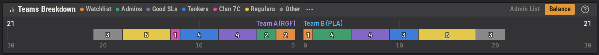
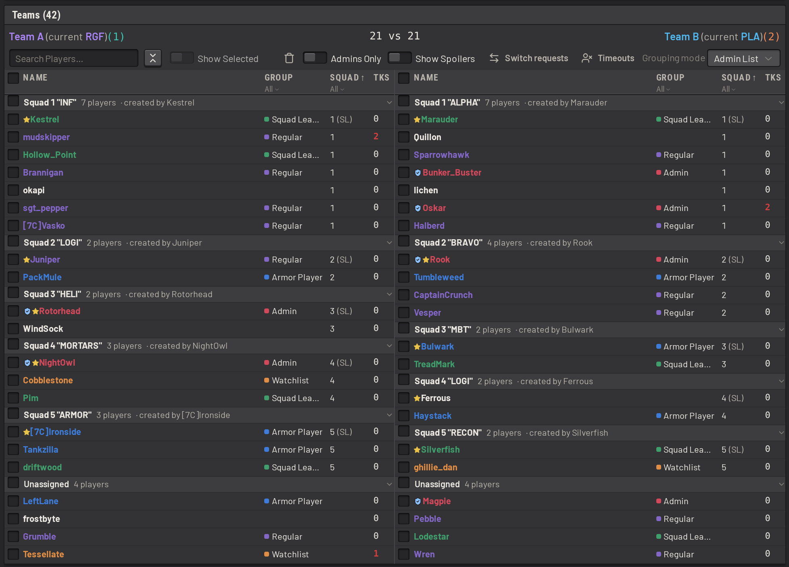
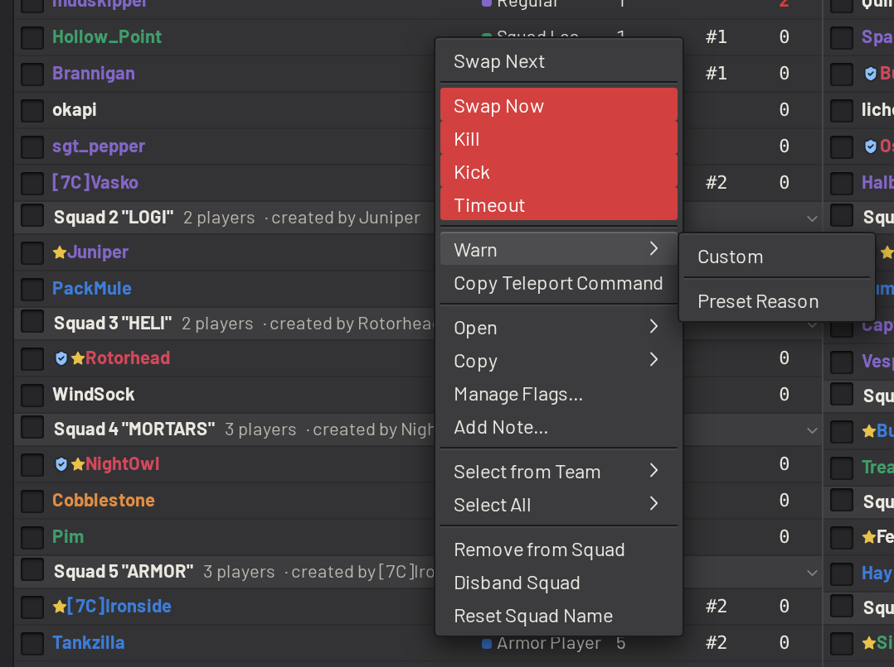
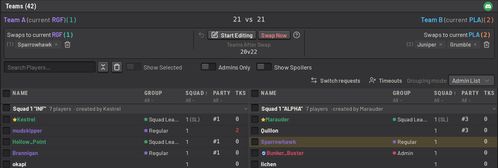
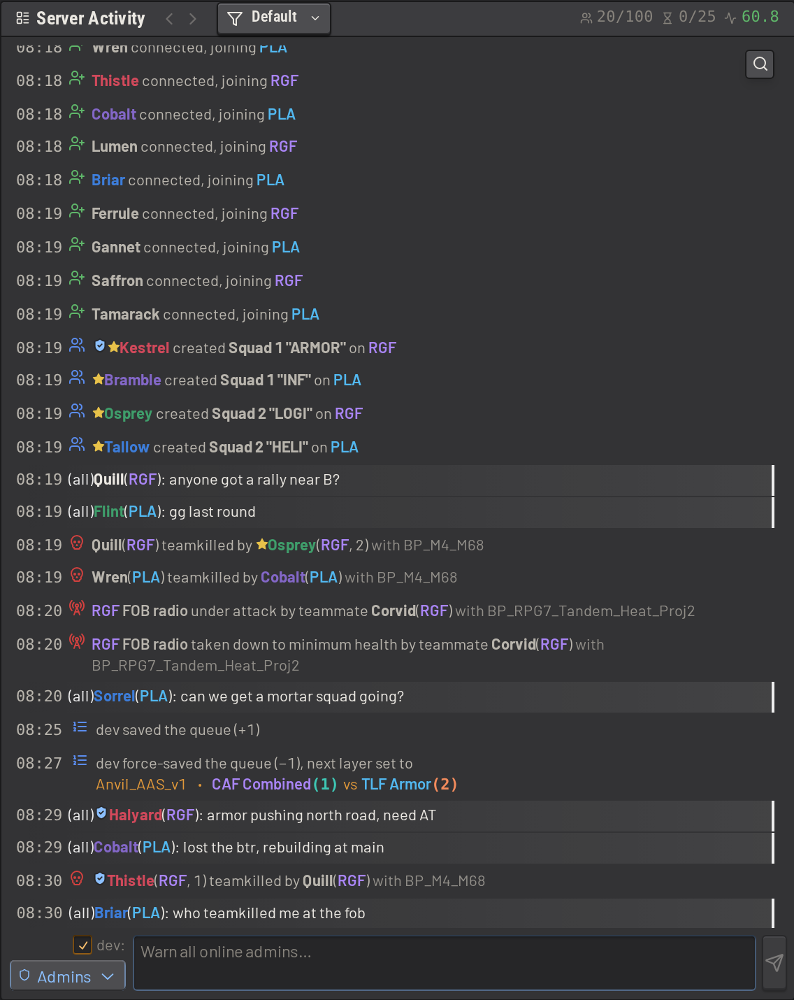
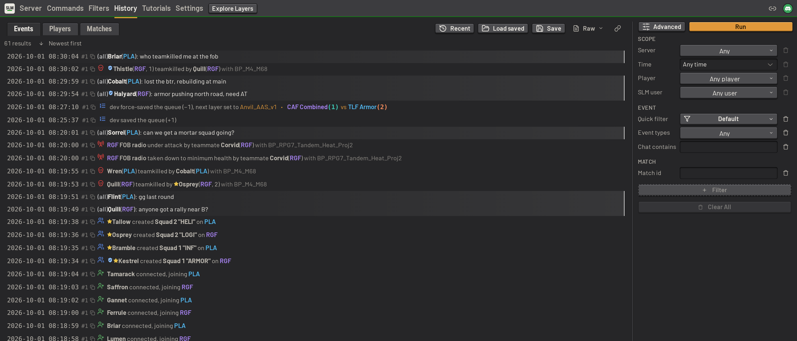
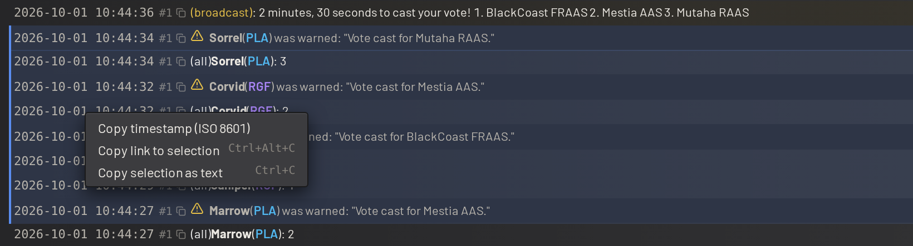
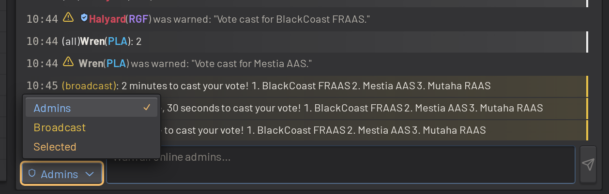

# Player management

SLM helps admins moderate and balance the players on their servers, from the dashboard or in game.

## Teams and balance

The teams panel lists both teams by squad. A _grouping mode_ sorts players into coloured groups by
[BattleMetrics](integrations_and_hosting.md#battlemetrics) flag, Discord role, a pattern on their name, or their group
in a standard Squad admin list. Use one to compare how your regulars, your admins or your flagged players split across
the teams. The _Party_ grouping mode groups players by the in-game party they queued with.

The _Party_ column shows each player's party. Filter or sort the table by party, or shift+click a party to select its
members on that team.

## Player details

Click a player for their IDs and profile links, their groups and BattleMetrics flags, their team and squad, and their
recent chat.

## BattleMetrics notes

A note is free text on a player's [BattleMetrics](integrations_and_hosting.md#battlemetrics) profile. Admins use notes
to brief each other: why a player was warned, or what to watch for next match. SLM signs each note it posts with the
name of the admin who wrote it.

Click _Load notes_ in a player's details window to list their notes, newest first. A note that records a flag change
shows the flag and the reason given for it. SLM fetches a player's notes only when asked, because each fetch counts
against your organization's BattleMetrics request limit.

To add a note, click the notebook button beside the player's flags, or right-click a player, a squad or a selection and
choose _Add Note..._. In game, type `/note Kestrel mic spam in local`.

### Your own BattleMetrics token

SLM adds flags and notes with your organization's BattleMetrics token, so BattleMetrics records them as made by
whoever owns that token. Save your own token to have BattleMetrics record them as yours.

1. Create a personal access token on the [BattleMetrics developer page](https://www.battlemetrics.com/developers).
   Give it the _player flags_ scopes to add and remove flags, and the _player notes_ scope to create notes.
2. Open the user menu and choose _BattleMetrics Token_.
3. Paste the token and click _Save_. SLM checks the token with BattleMetrics before saving it.
4. Link your Steam account when SLM asks. In-game flag and note commands use your token only when SLM knows the Steam
   account they come from.

SLM stores the token encrypted and never shows it again. To replace the token, paste a new one. To stop using it,
click _Remove_. If BattleMetrics rejects a saved token, SLM refuses the change and asks for a new token. The change is
not made with the organization's token instead.

## Admin actions

Right-click a player to warn, kick, time out, kill or swap them, to manage their BattleMetrics flags, or to add a note to
their BattleMetrics profile. In game, admins can also remove a player from their squad, demote a squad leader, or
disband a squad. Warns, kicks, timeouts, kills and swaps apply to a whole squad as well.

A timeout kicks the player, and kicks them again whenever they rejoin any server SLM manages, until the timeout expires.
Type `/timeout Kestrel 2h spamming` to time Kestrel out for two hours. Each role caps how long a timeout its members may
give.

Configure reasons such as teamkilling or soloing once, with the message each action sends. Admins then pick a reason
instead of typing the message out, in game or in the dashboard.

## Team swaps

Admins move players between teams from the teams panel. Right-click a player, a selection of players or a squad,
and choose _Swap Next_ or _Swap Now_.

- Use _Swap Next_ to add the players to the swaps panel. The panel lists each pending swap under the team the player is
  moving to, and counts how the teams will stand after the swaps. Save to commit the swaps. Several admins can edit the
  swaps at once, as with the queue. On the next map roll, SLM moves everyone on the list, and retries a swap that
  does not land.
- Use _Swap Now_ to move the players at once. SLM asks for confirmation first. Use _Swap Now_ on the panel to run
  every saved swap at once.

SLM warns each player in game when they are marked for a swap, when their swap is removed, and when an admin swaps
them on the spot. A swap keeps its destination across the map roll, even though the teams change sides. A player who
leaves, or reaches their destination on their own, is dropped from the list.

Admins can do the same in game with `/swapnext`, `/swapnow`, `/swapsquadnext`, `/swapsquadnow`, `/swaps` and
`/clearswaps`. Turn on _Warn on GUI Teamswaps_ to warn your in-game admins whenever someone swaps players from the
dashboard.

## Switch requests

Players ask to switch teams themselves with `/switch` (or a [trigger](integrations_and_hosting.md#in-game-commands) of
your own, such as `!switch`). Unlike an admin swap, a switch request waits for room on the other team, and lasts only
for the current match.

- If the player's team has more players than the other, SLM switches them at once.
- Otherwise they wait in line, first come first served on each side, and SLM reports each player's place.
- The first players in the two lines trade places.
- When a new player joins the team someone is waiting for, SLM moves the new player across and switches the waiting
  player into their slot.

Players type `/cancelswitch` to leave the line, and the line clears at every map roll. Admins see both lines in the
_Switch requests_ window, with each player's place and the next pair to trade, and can switch any player in it straight
away.

## Activity and history

The activity feed records events from the Squad server and from SLM as they happen. SLM lays the events out to be easy
to scan, and collapses repeats of some noisy events into one line. Filter the feed further to the relevant events.

Use the history page to search past events, players and matches by player, time, event type, layer, outcome and more.
Save a query for yourself or share the query with other admins, and export results as text or CSV.

In the feed or on the history page, click an event's time to start a selection, and Shift+click another to extend the
selection. Right-click the selection to copy the events as text, or to copy a link to them.

The match history lists each match's layer, length, outcome and who set it. Open a match to read its log and how
the teams were made up, or drag the match into the queue to play its layer again.

### Messaging admins and players

Use the chat box at the bottom of the activity feed to message the server without joining the game. Pick a target from
the chat box's menu: warn every online admin, broadcast to the whole server, or warn the players selected in the teams
panel. A checkbox beside the menu prefixes the message with your name.

